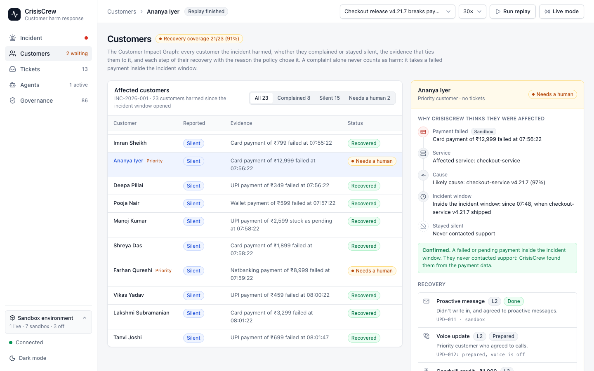
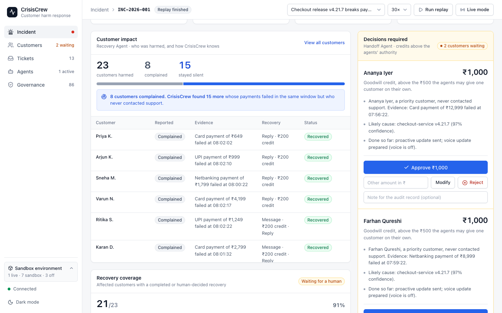
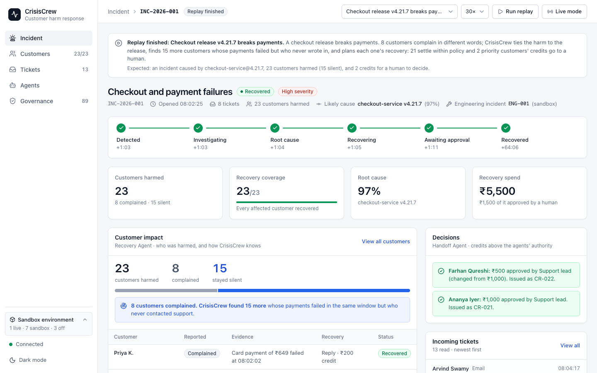
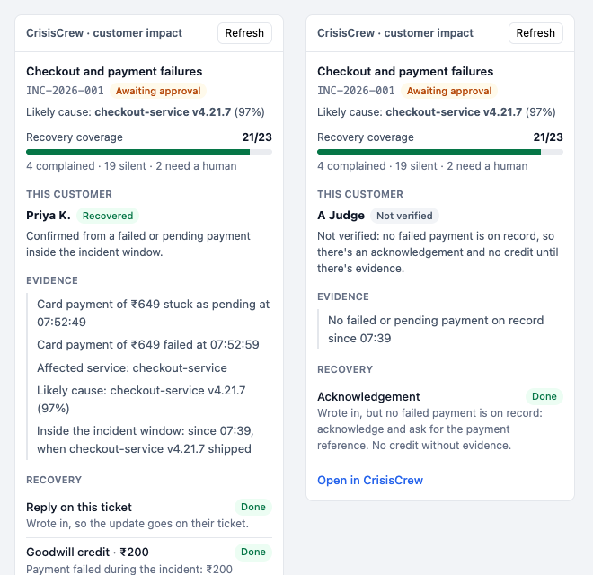
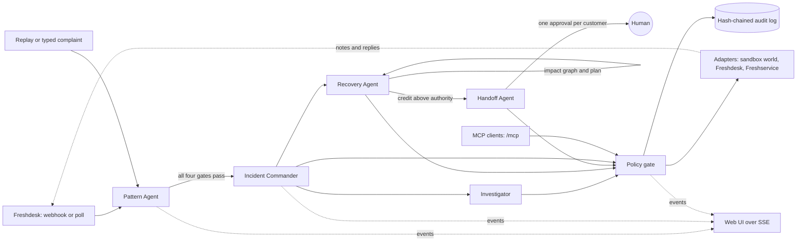

# CrisisCrew

**Customer harm response for Freshworks.** Incident tools tell engineering what broke. Support tools tell you who complained. CrisisCrew connects the two. When a burst of complaints describes the same failure, it:
1. verifies the incident against operational evidence;
2. works out who was actually harmed, including the customers who never opened a ticket;
3. plans each affected customer's recovery;
4. carries out the low-risk actions itself and stops for a human on money above its authority;
5. writes the outcome back into Freshworks.

Success is measured by **Recovery Coverage**: every affected customer recovered, not just an alert that fired.

> **23 customers were affected. 8 complained. 15 stayed silent.** Here is the evidence for each one, the recommended recovery, who may carry it out, and who still needs attention.

It was built for [The Great Agent Hackathon](https://the-great-agent-hackathon.devpost.com/) by Freshworks, where it's a Stage 2 finalist in Track 1 (customer and employee experience).


> **Status: it runs fully offline, in sandbox mode, and the Freshworks adapters are wired.**
> - **Real and running:**
>   - the detection engine, the Customer Impact Graph, the recovery policy and Recovery Coverage;
>   - the five agents, the policy gate and the audit log;
>   - the MCP server and the UI.
>
>   Every number on screen is computed from ticket text and data.
> - **Sandbox:** the world the agents act on (releases, gateway status, error rates, customers, consent and payment attempts) comes from replayable scenarios.
> - **Wired, not yet run against a real account:**
>   - Freshdesk: webhook or poll ingest, and private notes and replies through REST or Freshdesk's MCP server;
>   - Freshservice: engineering incidents;
>   - the Freshdesk ticket-sidebar app.
>
>   They switch on with keys in `.env`, and each is tested against a fake of its API. The team runs them against a trial account at the event.
> - **Designed, not wired:** GitHub deployments, Razorpay status, ElevenLabs, Claude and the sponsor APIs.
>
> The environment box in the UI's sidebar and `GET /api/wiring` show exactly what's live.

## What it does

| Step | Who | What happens |
|---|---|---|
| **Detect** | Pattern Agent | Compares each new complaint with the last 15 minutes by meaning and product area. It opens an incident only when a group passes four gates, and shows the plain reason when a group fails one. Detection is the trigger, not the product |
| **Verify** | Investigator | Checks the payment gateway, recent releases and service error rates, then ranks causes by prior × likelihood ratios, with every factor shown |
| **Prove who was harmed** | Recovery Agent | Builds the **Customer Impact Graph**. A customer is affected when they have a failed or pending payment inside the incident window, whether or not they wrote in. A complaint with no such payment is kept as *not verified* |
| **Find the silent** | Recovery Agent | The customers with failed payments who never contacted support: 15 of the 23 in the hero scenario |
| **Plan each recovery** | Recovery Agent | A plan per customer from their own evidence: the channel they allow, a voice update for priority customers, and a credit sized by the harm, each with its reason and the authority it needs |
| **Act within authority** | Recovery Agent | Updates, account notes and credits up to ₹500 per customer (₹5,000 per incident) run automatically |
| **Stop for a human** | Handoff Agent | Any credit above that becomes an approval for **one customer**, with their evidence. The approver approves, changes the amount or rejects, and exactly that amount is paid to exactly that customer |
| **Write back** | Recovery Agent, Incident Commander | Private notes and replies on the customer's Freshdesk ticket, an outcome note once their recovery is settled, and a Freshservice incident for engineering |
| **Decide how urgent** | Incident Commander | Sets the incident's importance, P1 to P3, from rules in `policy.json`: customers affected, money in failed payments, priority customers, a tier-1 area, a release as the likely cause. It rises as evidence arrives and never falls on its own; P1 means page on-call. See [Importance](#importance) |
| **Measure** | Incident Commander | Recovery Coverage = recovered confirmed customers / confirmed customers. The incident reaches **Recovered** only at 100% |

Every tool call, by an agent or an external MCP client, goes through one policy gate and lands in a hash-chained audit log.

## Quick start

You need Node 24 LTS (Node 25 also works) and pnpm 10.

```bash
git clone https://github.com/Sachin0496/crisiscrew.git
cd crisiscrew
pnpm install
pnpm start
```

Open http://localhost:8787, pick a scenario in the top bar, and click **Run replay**. You can also click **Live mode** and type complaints into the **Incoming tickets** box yourself. The box suggests the store's customers (Priya K., Arjun K., and so on), so a typed complaint is checked against that customer's payments. Any other name is a walk-in and stays *not verified*.

- **Keys:** none needed. To change a setting, copy `.env.example` to `.env`.
- **Model:** replays read embeddings from the committed cache, so they need no model. The first complaint you type downloads the embedding model (`Xenova/all-MiniLM-L6-v2`, 23 MB) into `.models/`. After that, everything works with no network.

| Command | What it does |
|---|---|
| `pnpm start` | Builds the UI and starts the server on port 8787: the UI, the API, the event stream, MCP and the Freshdesk webhook |
| `pnpm dev` | The server and the Vite dev server, both reloading on change, for UI work |
| `pnpm replay <scenario>` | Replays a scenario in the terminal and prints what each agent does. Add `--decide approve`, `reject` or `modify:500` to settle every approval |
| `pnpm eval` | Runs the evaluation and rewrites [docs/eval.md](docs/eval.md) |
| `pnpm test` | 256 tests with Vitest. They never load the model or call an external API |
| `pnpm typecheck` | Strict TypeScript across the workspace |
| `pnpm calibrate <model>` | The model comparison behind [docs/calibration.md](docs/calibration.md) |
| `pnpm embeddings:warm` | Embeds every scenario, prototype and eval sentence into the committed cache |

## The hero scenario, in the terminal

`pnpm replay checkout-v4.21.7` prints the whole response. Here it is, trimmed:

```text
+1:03  T-1007  chat   Varun N.   "Card rejected on checkout — card is fine."
         cluster of 4: similarity 0.65 (meaning 0.30, area 0.99)  size ✓  cohesion ✓  failure_share ✓  burst ✓
         fires: 4 failures in 18s is about 1 in 4 million at normal volume

  Root-cause ranking
     97.0%  checkout-service v4.21.7
            LR  6.00  released 14 min before the first complaint (3f9c2e1 by vikram-s)
            LR  8.38  checkout-service error rate 0.40% → 3.34% after the release (8.4×)

  customer impact: 23 affected (4 complained, 19 silent)
  INC-2026-001: importance P1, page on-call  23 customers affected (20 or more is P1)
  recovery plan: 48 actions for 23 customers, 2 credits for a human

  Approval APR-001 requested for Ananya Iyer: ₹1,000
    Ananya Iyer, a priority customer, never contacted support. Evidence: Card payment of ₹12,999 failed at 07:53:08.
    Likely cause: checkout-service v4.21.7 (97% confidence).
    Done so far: proactive update sent; voice update prepared (voice is off).
    Proposed: ₹1,000 goodwill credit, above the ₹500 the agents may give one customer on their own.

  INC-2026-001: awaiting approval  2 credits are above the agents' authority and waiting for a human; recovery coverage 21/23

+1:15  T-1008  phone  Ritika S.  "Can't complete payment for my order."
         joins INC-2026-001, which now has 5 tickets
  customer impact: 23 affected (5 complained, 18 silent)

Summary
  INC-2026-001: awaiting approval, P1, page on-call; root cause checkout-service v4.21.7 (97%); 8 tickets linked
  23 affected (8 complained, 15 silent); recovery coverage 21/23 (91%), 2 waiting for a human
  16 proactive contacts; credits ₹4,000 within authority, ₹0 approved, ₹2,000 awaiting approval
  audit: 87 tool calls, hash chain verified
```

Ritika was silent when the plan was made: her failed payment was already on record. When she writes in, she moves from silent to complained, and a reply on her ticket is added to her plan.

## Customer Impact Graph

Customer impact is **independent of ticket membership**. For each incident, CrisisCrew joins the complaints, the customers, their payment attempts, the affected service, the likely cause and the recovery actions:

| A customer is | When | What they get |
|---|---|---|
| **Confirmed, complained** | a failed or pending payment inside the incident window, and a ticket in the incident | the update as a reply on their ticket, and a credit sized by the harm |
| **Confirmed, silent** | a failed or pending payment inside the window, and no ticket | a proactive update if they agreed to one; otherwise nobody messages them and a note goes on their account. A credit either way |
| **Not verified** | a failure report in the incident, but no failed payment on record | an acknowledgement asking for a payment reference. **No credit and no proactive contact** until there's evidence |

The window opens at the cause's start (the release, in the hero) or 30 minutes before the first complaint.

Each customer carries the evidence that ties them to the incident, one sentence per edge of the graph. The **Customers** page shows it as a chain:

```
Ananya Iyer (priority)
 ├─ Card payment of ₹12,999 failed at 07:56:22
 ├─ Affected service: checkout-service
 ├─ Likely cause: checkout-service v4.21.7 (97%)
 ├─ Inside the incident window: since 07:48, when checkout-service v4.21.7 shipped
 ├─ Never contacted support
 └─ Confirmed → silently affected
```

`GET /api/incidents/:id/graph` returns the graph as nodes and edges. The MCP tool `get_customer_impact` returns it customer by customer.

| Customer impact, customer by customer | Dark mode |
|---|---|
|  |  |

## Recovery policy

Recovery is based on each customer's actual harm, not one blanket action. The numbers live in [`config/policy.json`](config/policy.json):

| Harm | Credit | Who decides |
|---|---|---|
| Their payment went through on a retry (low) | none; the update is enough | a recorded decision, with its reason |
| A failed or pending payment (medium) | ₹200 | the Recovery Agent, within authority |
| A priority customer, or a failed payment of ₹10,000 or more (high) | ₹1,000 | a human: it's above the ₹500 per-customer limit |
| Not verified | none | nobody: no money without evidence |

**Authority** is checked by the policy gate on every call:
- `issue_recovery_credit` takes one customer. It's **L2** when the amount is within ₹500 and the agents' running total for the incident stays within ₹5,000. It's **L3** otherwise, which needs an approved approval for exactly that customer and amount.
- The gate also refuses:
  - a credit for anyone who isn't a confirmed affected customer;
  - a second credit for the same customer;
  - any amount other than the planned one, or the approved one.
- A proactive message or voice update needs confirmed impact as well as the customer's consent.

**In the hero:**
- 20 customers get ₹200 automatically (₹4,000).
- Nisha paid on a retry, so she gets the update and no credit.
- Pooja, Manoj and Lakshmi opted out of proactive messages. Nobody messages them; their accounts get a note and a credit.
- Ananya and Farhan are priority customers, so their ₹1,000 credits wait for a human.

## Importance

The Incident Commander decides how urgently engineering must act. The rules are deterministic, and their thresholds live in [`config/policy.json`](config/policy.json) under `importance`:

| Rule | P2 at | P1 at |
|---|---|---|
| Confirmed affected customers | 5 | 20 |
| Failed or pending payments of those customers | ₹25,000 | ₹2,00,000 |
| Priority customers affected | 1 | 3 |
| A tier-1 area (checkout and payments, login and account) | always | |
| A release ranked as the cause at 80% or more (a rollback is an option) | always | |
| An alert on a service behind the incident (once Alert Management is wired) | warning | critical |

- **How the level is set:** each rule that fires adds a reason, and the level is the most urgent one; P3 when none fires. **P1 means page the on-call engineer** (`pageAt`).
- **When:** the Commander assesses when the incident opens (only the area is known, so the hero starts at P2), again once impact and the root cause are known, and after every recovery pass. The level rises on its own and never falls.
- **Engineering's record follows it:** Freshservice priority, urgency and impact are P1 → 4, 3, 3 · P2 → 3, 2, 2 · P3 → 2, 1, 1. A rise sets them again and adds a note with every reason.
- **A human can overrule it:** `POST /api/incidents/:id/importance` with `{"level": "P2", "note": "..."}` (admin token). From then on the rules leave it alone.

In the hero, 23 affected customers make it P1. The UPI outage stays P2: 10 customers affected and one priority customer, below the P1 thresholds.

## Recovery Coverage

```
Recovery coverage = confirmed affected customers with a completed or human-decided recovery
                    ------------------------------------------------------------------------
                                     confirmed affected customers
```

- It climbs as actions complete: **21/23 (91%)** once the agents are done, with 2 waiting for a human, then **23/23** after the decisions.
- The incident shows **Awaiting approval** while any credit waits, and reaches **Recovered** only at 100%.
- A rejected credit counts as handled. The human decided, and the update was already sent.

The coverage card also tracks:
- the time from complaint to incident (18 s);
- silent customers found (15);
- duplicate tickets avoided (7);
- proactive contacts delivered;
- customers still unrecovered;
- recovery spend: issued within authority, approved, and waiting.

| Waiting for two decisions | After the decisions: recovered |
|---|---|
|  |  |

## Freshworks

Freshdesk is the customer signal layer; Freshservice and engineering systems are the operational evidence layer. Each integration is switched on by one variable in `.env`, and a live adapter never quietly falls back to fake data.

**Freshdesk** (`TICKETS=freshdesk`, with `FRESHDESK_DOMAIN` and `FRESHDESK_API_KEY`)
- **Ingest:**
  - **Webhook (`FRESHDESK_INGEST=webhook`):** an automation rule on ticket creation calls `POST {PUBLIC_BASE_URL}/api/webhooks/freshdesk`. The body is `{"ticket_id": {{ticket.id}}}`, with the header `X-CrisisCrew-Secret: <FRESHDESK_WEBHOOK_SECRET>`. CrisisCrew answers 202, then reads the ticket back with `GET /api/v2/tickets/:id?include=requester`.
  - **Poll (`FRESHDESK_INGEST=poll`):** reads new tickets every 15 seconds and needs no public URL.
  - Either way, each ticket is ingested once.
- **Matching:** the requester's email is matched to a customer in the orders data. A requester who can't be matched is a real complaint with no payment evidence, so they're *not verified*.
- **Write-back:**
  - a private note linking the ticket to the incident;
  - the customer's update as a reply;
  - a private outcome note (evidence, and what was done) once their recovery is settled.
- **Write-back route:** REST by default. `FRESHDESK_ACTIONS=mcp` sends the notes and replies through [Freshdesk's official MCP server](https://support.freshdesk.com/support/solutions/articles/50000012670) (`createTicketNote`, `replyTicket`) instead. Freshdesk doesn't publish those tools' argument names, so the adapter reads them from each tool's schema when it connects.
- **Mixed sessions:** tickets from replays or the UI stay in the sandbox.

**Freshdesk ticket sidebar** ([`integrations/freshdesk-sidebar/`](integrations/freshdesk-sidebar/)): a Freshworks app (platform 3.0) for the ticket sidebar. On any ticket, it shows:
- the incident, its likely cause and its coverage;
- whether this customer is confirmed or not verified;
- their evidence and recovery.

It reads `GET /api/freshdesk/tickets/:id`. Its README says how to run it with `fdk`.



**Freshservice** (`INCIDENTS=freshservice`, with `FRESHSERVICE_DOMAIN`, `FRESHSERVICE_API_KEY` and `FRESHSERVICE_REQUESTER_EMAIL`)
- The Incident Commander files an incident when a CrisisCrew incident opens.
- It then adds private notes: the investigation, and customer impact with coverage.
- In sandbox mode, the record (`ENG-001`) is kept in memory and labeled as sandbox.
- With the switch on, **every** incident files a real Freshservice incident, replays included.

**Agent Studio and MCP:** the read-only operator identity can call `get_customer_impact` and `get_recovery_coverage`. So an MCP client can see the same live incident customer by customer, including Freshservice's Agent Studio MCP Gateway once the team has access (see [MCP server](#mcp-server)).

## Scenarios

Six hand-written worlds in [`scenarios/`](scenarios/). Half of them test restraint.

| Scenario | What happens | Outcome |
|---|---|---|
| `checkout-v4.21.7` (the hero) | A checkout release breaks payments. 8 customers complain in different words; 15 more fail silently | An incident on the 4th complaint and the release as the cause (97%). 23 harmed; 21 recovered within policy; 2 priority customers' ₹1,000 credits go to a human |
| `upi-provider-outage` | UPI fails at the payment provider, with no recent release | The provider is the cause (94%), not a release. 10 harmed (4 silent); 9 recovered within policy; 1 priority customer's credit goes to a human |
| `lookalike-checkout-questions` | Five questions about paying at checkout, and one failure | No incident: "4 of 5 are questions, not failures" |
| `scattered-failures` | Five real failures about different things in ten minutes | No incident: no group reaches 4 similar tickets |
| `two-card-complaints` | Two unrelated complaints that both mention a card | No incident: similarity 0.26, and only 2 tickets |
| `quiet-day` | Two hours of normal traffic | No incident |

## What you'll see

The web UI is a production-style console, light by default with a dark mode. A sidebar leads to five pages:
- **Incident:**
  - the header, a progress stepper that ends at *Recovered*, and four numbers: customers harmed, recovery coverage, root cause and recovery spend;
  - the main column, customer impact first: the silent-customer callout and a row per customer, then recovery coverage, root cause and detection;
  - the side column: the per-customer decisions, tickets, the timeline and agent activity.
- **Customers:** the Customer Impact Graph, filterable by complained, silent, needs a human and not verified, with each customer's evidence chain, their recovery plan and the decision controls.
- **Tickets:** every ticket, tagged as a failure report or a question, with where its customer stands.
- **Agents:** what each agent is doing, and every tool call with the adapter that served it.
- **Governance:** the hash-chained audit log and the permissions table.

| Restraint: similar words, but not an incident | Tickets and customer impact |
|---|---|
|  |  |
| **Governance** | |
|  | |

## How it works



**One process:** `apps/server` holds the engine. It serves the JSON API, the event stream (SSE), the MCP endpoint, the Freshdesk webhook and the built UI. So MCP calls, Freshdesk tickets, typed tickets and approvals all act on the same incident.

**Recovery is one idempotent pass,** run after the root cause, for each later complaint and after each human decision:
1. rebuild the impact graph;
2. plan only the actions each customer is still missing;
3. carry out everything within authority;
4. hand the rest to the Handoff Agent;
5. set the incident's status from coverage.

Passes for one incident run one at a time, so nothing is planned or paid twice.

### Detection (the Pattern Agent)

- **Similarity** between two tickets = ½ × *meaning* + ½ × *product area*.
  - *Meaning* is the cosine of their sentence embeddings, from `all-MiniLM-L6-v2`, running on this machine through transformers.js.
  - *Product area* compares how close each ticket is to short prototype sentences for checkout and payments, login, delivery, refunds and app performance.
  - There are no keyword lists. "Checkout keeps loading", "UPI isn't working" and "card rejected" share no words, but they land together.
- **Failure or question:** a ticket's failure score is its similarity to failure prototypes minus its similarity to question prototypes. A ticket phrased as a question loses 0.3.
- **Grouping:** tickets from the last 15 minutes are connected when their similarity is at least 0.5. Questions stay in the group so the failure-share gate can refuse a question-heavy burst in plain view. The incident, though, is made of the failure reports only.
- **Four gates, all required:**

| Gate | Threshold | Refuses, for example |
|---|---|---|
| Size | at least 4 tickets | "only 2 tickets in this group (needs 4)" |
| Similarity | the group's mean pairwise similarity is at least 0.55 | complaints about different things |
| Failure share | at least 75% report a failure | "4 of 5 are questions, not failures" |
| Burst | Poisson tail p ≤ 0.001 against the normal volume (at least 3 an hour) | failures at the usual daily rate |

The model and the similarity were chosen on labeled pairs before any threshold was fixed. See [docs/calibration.md](docs/calibration.md): plain embeddings scored an AUC of 0.94, and the hybrid scores 1.00.

### Root cause (the Investigator)

Each hypothesis is scored as its prior multiplied by the likelihood ratios of its evidence, then normalised. The "unknown" hypothesis always stays in, so nothing reaches 100% by elimination.

| Evidence | Likelihood ratio |
|---|---|
| Time from a release to the first complaint | 6 within 30 minutes, 3 within 2 hours, 0.5 beyond that, 0.2 if the release came after the first complaint |
| The service's error-rate ratio after the release | the ratio itself, capped at 10, when it's at least 2 · 1 between 1.2 and 2 · 0.3 below 1.2 |
| Payment provider status | 0.1 when operational · 8 when degraded · 1 when the check fails |
| Payment methods named in the complaints | 2 when one method dominates (80% or more) · 0.7 when they're spread |

The priors (deploy 0.5, provider 0.25, unknown 0.25) are stated assumptions in [`config/policy.json`](config/policy.json), and the UI says so.

### Authority: the policy gate

Each agent is a separate identity with an allow-list and a maximum level. The gate checks a call in this order:
1. the tool exists;
2. it's on the caller's allow-list;
3. its arguments parse;
4. its authority level, which can depend on the arguments and on what's already been spent;
5. any condition the tool sets, such as consent, evidence of harm, or an exact approved amount.

| Level | Meaning |
|---|---|
| L0 read | reads data, including the impact graph |
| L1 limited write | internal, reversible changes: incidents, links, notes, drafts, plans, approval requests |
| L2 customer contact | messages customers who agreed to it, or credits within authority |
| L3 human approval | a credit above authority, with an approved approval for that customer and amount |

**Every call writes one audit entry,** allowed or refused. Each entry carries the SHA-256 of the previous one, so editing any entry breaks the chain. `GET /api/audit/verify` re-checks it.

| Agent | Highest level | Tools |
|---|---|---|
| Pattern Agent | L0 | `search_recent_tickets`, `get_incident` |
| Incident Commander | L1 | `open_incident`, `file_engineering_incident`, `update_engineering_incident`, `get_recovery_coverage`, `get_incident`, `search_recent_tickets` |
| Investigator | L0 | `get_payment_health`, `get_recent_deployments`, `get_service_status`, `get_incident` |
| Recovery Agent | L2 | `identify_affected_customers`, `link_ticket_to_incident`, `add_ticket_note`, `draft_customer_update`, `plan_recovery`, `send_customer_update`, `add_account_note`, `issue_recovery_credit` (within authority), `get_incident`, `get_customer_impact` |
| Handoff Agent | L3 | `request_human_approval`, `issue_recovery_credit` (with approval), `add_ticket_note`, `get_incident`, `get_customer_impact` |
| External MCP client (operator) | L0 | the seven read tools, including `get_customer_impact` and `get_recovery_coverage` |

## MCP server

`/mcp` is a stateless Streamable HTTP MCP server. The bearer token picks the identity, and each identity sees only its own tools. Calls go through the same gate and audit log as the agents.

Tokens come from `MCP_TOKEN_*` in `.env`. Any that aren't set are generated at startup and printed in the console.

```bash
# The read-only operator sees seven read tools
curl -s http://localhost:8787/mcp -H 'content-type: application/json' -H 'accept: application/json, text/event-stream' \
  -H "authorization: Bearer $MCP_TOKEN_OPERATOR" -d '{"jsonrpc":"2.0","id":1,"method":"tools/list"}'

# The silent customers of the latest incident, with their evidence and recovery state
curl -s http://localhost:8787/mcp -H 'content-type: application/json' -H 'accept: application/json, text/event-stream' \
  -H "authorization: Bearer $MCP_TOKEN_OPERATOR" \
  -d '{"jsonrpc":"2.0","id":2,"method":"tools/call","params":{"name":"get_customer_impact","arguments":{"filter":"silent"}}}'

# The Pattern Agent's token tries to write: refused, and audited
curl -s http://localhost:8787/mcp -H 'content-type: application/json' -H 'accept: application/json, text/event-stream' \
  -H "authorization: Bearer $MCP_TOKEN_PATTERN" \
  -d '{"jsonrpc":"2.0","id":3,"method":"tools/call","params":{"name":"link_ticket_to_incident","arguments":{"ticketId":"T-1001","incidentId":"INC-2026-001"}}}'
```

MCP Inspector, Claude, or Freshservice's Agent Studio MCP Gateway can connect the same way: the URL plus an `Authorization: Bearer` header.

## HTTP API

| Method and path | Purpose |
|---|---|
| `GET /api/health` | liveness, version and the current session |
| `GET /api/wiring` | each port's mode (live, sandbox or off), and its available and planned live adapters |
| `GET /api/state` | a snapshot for the UI: tickets, incidents with their impact and recovery actions, agents, approvals, credits |
| `GET /api/stream` | the SSE event stream, which resumes from `Last-Event-ID` |
| `GET /api/scenarios` | the scenarios and their expected outcomes |
| `GET /api/customers` | the current world's customers, for the ticket box |
| `GET /api/incidents/:id/graph` | the Customer Impact Graph as nodes and edges |
| `GET /api/tickets/:id/impact` | what CrisisCrew knows about a ticket's customer |
| `GET /api/freshdesk/tickets/:id` | the same, by Freshdesk ticket id: what the sidebar app reads |
| `POST /api/webhooks/freshdesk` | Freshdesk's automation rule: `{"ticket_id": 123}` with `X-CrisisCrew-Secret` |
| `POST /api/replay` | start a replay: `{"scenario": "...", "speed": 2}` |
| `POST /api/live` | start a fresh live session |
| `POST /api/tickets` | type a ticket: `{"customerName": "...", "body": "..."}`; a known customer's name or `customerEmail` ties it to their payments |
| `POST /api/incidents/:id/importance` | admin: `{"level": "P1", "P2" or "P3", "note"?: "..."}` sets the importance by hand; the rules then leave it alone |
| `POST /api/approvals/:id` | `{"decision": "approve", "reject" or "modify", "amountInr"?: 500}` for one customer's credit |
| `GET /api/audit`, `GET /api/audit/verify` | audit entries, and the hash-chain check |
| `GET /api/policy` | the agents × tools permission matrix and limits, computed from `config/policy.json` |
| `POST /mcp` | the MCP endpoint |

The `POST` routes need `ADMIN_TOKEN`, or `APPROVER_TOKEN` for approvals, when those are set. With them unset, the routes are open, which suits a local demo. Set both before exposing the server through a tunnel.

## What's real and what's sandbox

| Port | Today | Switch it on with | Variables in `.env.example` |
|---|---|---|---|
| Embeddings | **live**: `all-MiniLM-L6-v2` on this machine | on by default | `EMBEDDINGS_MODEL`, `EMBEDDINGS_THREADS` |
| Tickets | sandbox: scenario replay and typed tickets | `TICKETS=freshdesk`: webhook or poll ingest; notes and replies through REST or Freshdesk's MCP server. **Wired; tested against a fake Freshdesk** | `FRESHDESK_*` |
| Engineering incidents | sandbox: kept in memory | `INCIDENTS=freshservice`. **Wired; tested against a fake Freshservice** | `FRESHSERVICE_*` |
| Orders (customers, consent, payment attempts) | sandbox: the scenario's world | none planned: in production this reads the commerce platform | none |
| Deployments | sandbox: the scenario's releases | GitHub Deployments API (designed, not wired) | `GITHUB_*` |
| Payment health | sandbox: the scenario's gateway status | Razorpay's public status API (designed, not wired) | `RAZORPAY_STATUS_URL` |
| Metrics | sandbox: simulated from the scenario | none planned | none |
| Voice | off: scripts are prepared, not spoken | ElevenLabs (designed, not wired) | `ELEVENLABS_*` |
| LLM | off: fixed templates | Claude for narratives and drafts (designed, not wired). It would never compute the numbers | `ANTHROPIC_*` |
| Credits | sandbox: an in-memory ledger | Dodo Payments test mode (designed, not wired) | `DODO_PAYMENTS_*` |
| Translation | off | Sarvam, for Hindi and Hinglish tickets (designed, not wired) | `SARVAM_API_KEY` |

Selecting an adapter that isn't wired, or a wired one without its keys, stops the server at startup with a clear message:

```
CrisisCrew can't start: TICKETS=freshdesk needs FRESHDESK_DOMAIN and FRESHDESK_API_KEY; see .env.example
```

## Results

The full reports are [docs/calibration.md](docs/calibration.md) and [docs/eval.md](docs/eval.md). The eval measures detection, linking and root cause; the pivot didn't change them, and a re-run on 2026-09-24 gives the same numbers.

| Measure | Result on the held-out test split |
|---|---|
| Incident precision | 100% (15 of 15 incidents opened were real) |
| Incident recall | 100% (15 of 15 real incidents caught) |
| Linking precision and recall | 100% and 99% |
| Median detection | at the 4th complaint, 55 seconds after the first |
| Root cause correct | 100% of caught incidents |

The known weak spot is several *different* delivery problems arriving within ten minutes: an incident opens in 10 of 20 stress runs. The data is hand-written and synthetic, and the reports say so. The recovery numbers (who is harmed, coverage, spend) come from the scenarios' worlds and are checked by the lifecycle tests.

## Tests

256 tests with Vitest run on every push in CI (GitHub Actions: install, typecheck, test, build). None loads the embedding model or calls an external API. They cover:
- the maths, each detection gate, and root-cause scoring;
- the impact assessment (confirmed, not verified, paid on retry, severity, every evidence edge), the recovery planner (every rule, budget escalation), and coverage and its metrics;
- every agent × tool permission, per-customer credit authority, exact approved amounts, and audit-chain tampering;
- the full response for every scenario: 21/23 then 23/23 after approve and modify, a rejection, a silent customer who writes in, and an unverified complaint;
- Freshdesk:
  - against a fake Freshdesk: auth, requests, errors, the webhook's secret and idempotency, requester matching, the poll fallback and write-back routing;
  - the MCP writer against a fake MCP server;
- Freshservice incidents, against a fake Freshservice;
- the sidebar app's renderer against the server's real payload;
- the HTTP API, the event stream, and MCP through the official SDK client;
- the UI's routing, progress, customer rows, filters and decisions.

## Stage 1 → Stage 2 → the pivot

- **Stage 1 was a scripted prototype.** A single HTML page played a 12-second animation, and its numbers were typed into the page. It's archived unchanged in [`prototype/`](prototype/).
- **Stage 2 is the real system.** Correlation, confidence, affected counts and credits are computed from data, and the agents make real tool calls through a real permission gate.
- **The pivot** ([issue #1](https://github.com/Sachin0496/crisiscrew/issues/1), design in [docs/customer-harm-response.md](docs/customer-harm-response.md)) moves the product from "detect outages from similar tickets" to customer harm response:
  - prove who was harmed;
  - find the silent;
  - recover each customer by their own harm;
  - measure coverage;
  - work natively in Freshworks.

It was built before the event, as the organizers allowed by email: they told finalists that teams can work beforehand and that Stage 2 is mostly presentation. The git history shows each step. [docs/compliance.md](docs/compliance.md) checks the project against the hackathon rules.

## Repository layout

```
crisiscrew/
├── packages/
│   ├── contracts/   zod schemas and types shared by server and UI; the event reducer; coverage, metrics and the impact graph
│   ├── core/        the engine, with no I/O: correlation, agents, root cause, impact assessment, recovery planning, policy gate, audit
│   └── adapters/    sandbox ports, the Freshdesk and Freshservice adapters, and the embedders (local model, cache, hash)
├── apps/
│   ├── server/      the one process: Hono API, SSE, MCP, Freshdesk webhook, runtime, replay CLI, eval
│   └── web/         React console, driven by the event stream
├── integrations/
│   └── freshdesk-sidebar/  the Freshdesk ticket-sidebar app (Freshworks platform 3.0)
├── config/policy.json   levels, allow-lists, limits, thresholds, priors, recovery policy: data, not code
├── scenarios/       six scenarios, the eval's paraphrase pools, the committed embedding cache
├── prototype/       the Stage 1 page, archived unchanged
└── docs/            design, the pivot's design, calibration, eval, compliance, demo script and more
```

## Documentation

| Document | What's in it |
|---|---|
| [customer-harm-response.md](docs/customer-harm-response.md) | The pivot: the Customer Impact Graph, the recovery policy, Recovery Coverage, and the Freshworks workflow |
| [design.md](docs/design.md) | The Stage 2 spec: architecture, detection and root-cause formulas, interfaces, risks |
| [calibration.md](docs/calibration.md) | How the model and the hybrid similarity were chosen |
| [eval.md](docs/eval.md) | Precision, recall, linking, latency and the threshold sweep |
| [compliance.md](docs/compliance.md) | The hackathon rules, checked one by one, and what's left for the team |
| [demo-script.md](docs/demo-script.md) | The Main Stage flow, fallbacks and likely questions |
| [prep-checklist.md](docs/prep-checklist.md) | What to do before and at the event, including the Freshdesk setup |
| [submission.md](docs/submission.md) | The updated Devpost description, ready to paste |
| [build-plan.md](docs/build-plan.md) | The plan the Stage 2 build followed |

## Limits and next steps

- **Orders are sandbox:** customers, consent and payment attempts come from the scenario. In production, the orders port reads the commerce platform or payment gateway. That's what turns the impact graph from a demo into a record.
- **Not yet run against real accounts:** the Freshdesk, Freshservice and sidebar integrations are wired and tested against fakes. The team runs them with a trial account at the event.
- **Silent customers get proactive messages in the sandbox:** they have no Freshdesk ticket to reply on. Freshdesk outbound email is the natural channel, and it's next.
- **English only:** Hindi and Hinglish need the multilingual model or Sarvam translation.
- **Uncalibrated priors and a hand-set recovery policy:** the root-cause priors and the credit amounts are stated assumptions in `config/policy.json`.
- **Memory only:** no database and no accounts. State lives in memory, plus JSONL audit files.

## License

[MIT](LICENSE)
