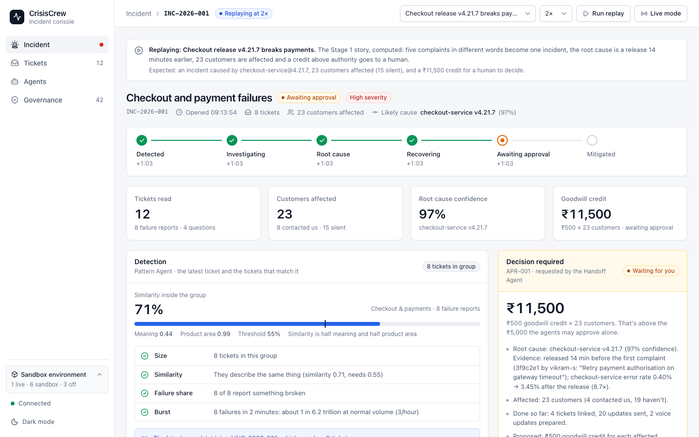
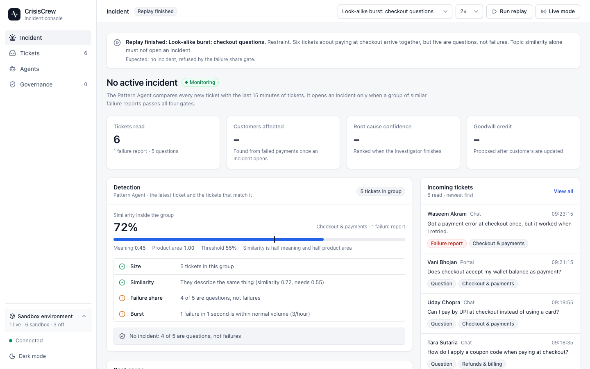
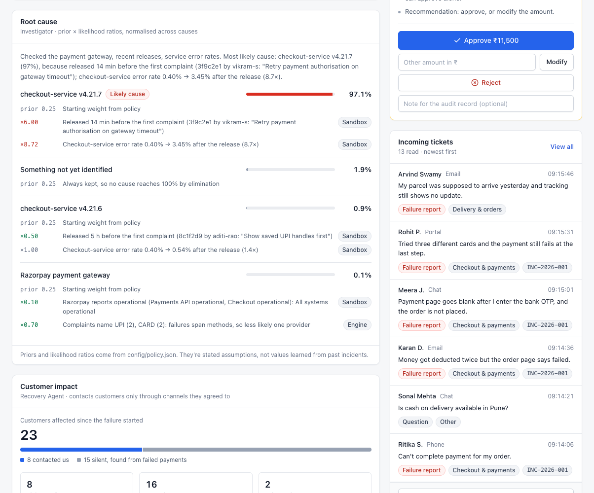
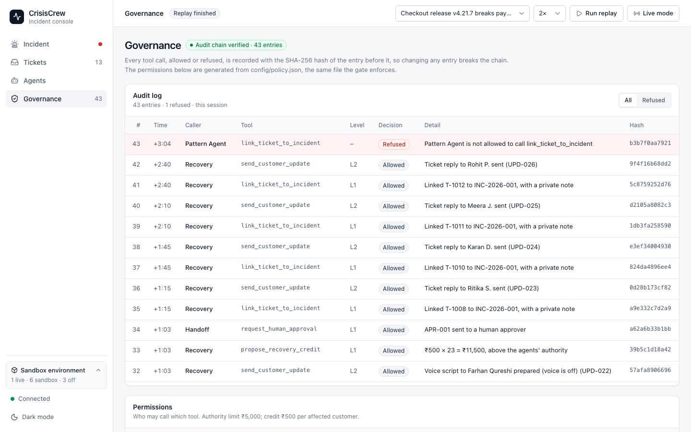
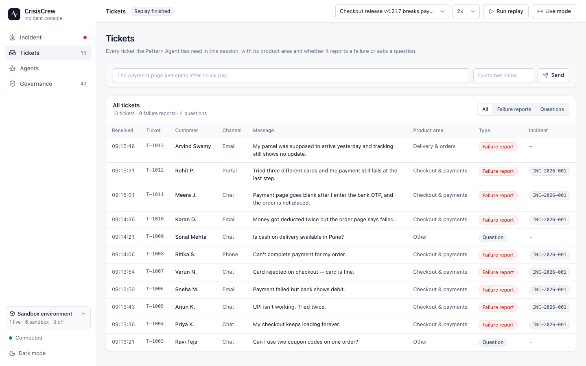
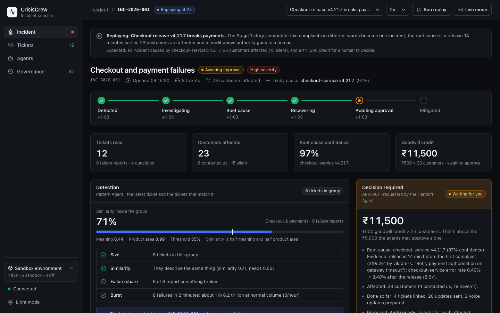
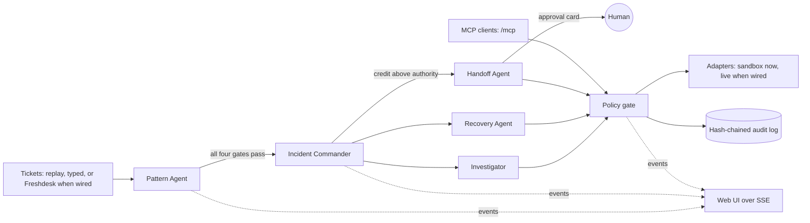

# CrisisCrew

**Customers notice outages before dashboards do.** CrisisCrew reads incoming support tickets as incident telemetry. When a burst of complaints describes the same failure in different words, it:
1. opens one incident;
2. finds the likely cause;
3. updates every affected customer, including those who never wrote in;
4. stops for a human when an action exceeds its authority.

It was built for [The Great Agent Hackathon](https://the-great-agent-hackathon.devpost.com/) by Freshworks, where it's a Stage 2 finalist in Track 1 (customer and employee experience).



> **Status: it runs fully offline, in sandbox mode.**
> - **Real and running:** the detection engine, the five agents, the policy gate, the audit log, the MCP server and the UI. Every number on screen is computed from ticket text and data.
> - **Sandbox:** the world the agents act on (releases, payment-gateway status, error rates, customers and orders) comes from replayable scenarios.
> - **Not wired yet:** the external APIs (Freshdesk, GitHub, Razorpay status, ElevenLabs, Claude and the sponsor APIs). They're designed and listed in [`.env.example`](.env.example).
>
> The environment box in the UI's sidebar and `GET /api/wiring` show exactly what's live.

## What it does

| Step | Agent | What happens |
|---|---|---|
| **Detect** | Pattern Agent | Compares each new ticket with the last 15 minutes by meaning and product area. It opens an incident only when a group passes four gates, and shows the plain reason when a group fails one |
| **Open** | Incident Commander | Opens the incident and runs the Investigator and the Recovery Agent in parallel |
| **Investigate** | Investigator | Checks the payment gateway, recent releases and service error rates, then ranks root causes by prior × likelihood ratios, showing every factor |
| **Recover** | Recovery Agent | Links the tickets, finds affected customers who never complained, and sends everyone the same update through channels they agreed to |
| **Hand off** | Handoff Agent | A goodwill credit above the ₹5,000 authority limit waits for a human, who approves it, changes the amount or rejects it. Exactly the approved amount is paid |

Every tool call, by an agent or an external MCP client, goes through one policy gate and lands in a hash-chained audit log.

## Quick start

You need Node 24 LTS (Node 25 also works) and pnpm 10.

```bash
git clone https://github.com/Sachin0496/crisiscrew.git
cd crisiscrew
pnpm install
pnpm start
```

Open http://localhost:8787, pick a scenario in the top bar, and click **Run replay**. You can also click **Live mode** and type complaints into the **Incoming tickets** box yourself.

- **Keys:** none needed. To change a setting, copy `.env.example` to `.env`.
- **Model:** replays read embeddings from the committed cache, so they need no model. The first complaint you type downloads the embedding model (`Xenova/all-MiniLM-L6-v2`, 23 MB) into `.models/`. After that, everything works with no network.

| Command | What it does |
|---|---|
| `pnpm start` | Builds the UI and starts the server on port 8787: the UI, the API, the event stream and MCP |
| `pnpm dev` | The server and the Vite dev server, both reloading on change, for UI work |
| `pnpm replay <scenario>` | Replays a scenario in the terminal and prints what each agent does. Add `--decide approve`, `reject` or `modify:5000` to settle the approval |
| `pnpm eval` | Runs the evaluation and rewrites [docs/eval.md](docs/eval.md) |
| `pnpm test` | 196 tests with Vitest. They never load the model |
| `pnpm typecheck` | Strict TypeScript across the workspace |
| `pnpm calibrate <model>` | The model comparison behind [docs/calibration.md](docs/calibration.md) |
| `pnpm embeddings:warm` | Embeds every scenario, prototype and eval sentence into the committed cache |

## The hero scenario, in the terminal

`pnpm replay checkout-v4.21.7` prints the whole incident. Here it is, trimmed:

```text
+0:45  T-1004  chat   Priya K.   "My checkout keeps loading forever."
         Checkout & payments · reports a failure (0.49)
+0:52  T-1005  chat   Arjun K.   "UPI isn't working. Tried twice."
+0:59  T-1006  email  Sneha M.   "Payment failed but bank shows debit."
+1:03  T-1007  chat   Varun N.   "Card rejected on checkout — card is fine."
         cluster of 4: similarity 0.65 (meaning 0.30, area 0.99)  size ✓  cohesion ✓  failure_share ✓  burst ✓
         fires: 4 failures in 18s is about 1 in 4 million at normal volume

  Root-cause ranking
     97.0%  checkout-service v4.21.7
            LR  6.00  released 14 min before the first complaint (3f9c2e1 by vikram-s)
            LR  8.42  checkout-service error rate 0.41% → 3.43% after the release (8.4×)
      1.9%  Something not yet identified
      1.0%  checkout-service v4.21.6
      0.1%  Razorpay payment gateway
            LR  0.10  razorpay reports operational
            LR  0.70  complaints name UPI (1), CARD (1): failures span methods, so less likely one provider

Summary
  INC-2026-001: awaiting_approval; root cause checkout-service v4.21.7 (97%); 8 tickets linked;
  23 affected (15 silent); 24 updates sent, 2 voice prepared; credit ₹11,500 awaiting approval
  audit: 42 tool calls, hash chain verified
```

## Scenarios

Six hand-written worlds in [`scenarios/`](scenarios/). Half of them test restraint.

| Scenario | What happens | Outcome |
|---|---|---|
| `checkout-v4.21.7` (the hero) | A checkout release breaks payments. 8 customers complain in different words, and 15 more fail silently | An incident on the 4th complaint. The root cause is the release (97%), and a ₹11,500 credit goes to a human |
| `upi-provider-outage` | UPI fails at the payment provider, with no recent release | An incident. The root cause is the provider (94%), not a release, and a ₹5,000 credit is issued within authority |
| `lookalike-checkout-questions` | Five questions about paying at checkout, and one failure | No incident: "4 of 5 are questions, not failures" |
| `scattered-failures` | Five real failures about different things in ten minutes | No incident: no group reaches 4 similar tickets |
| `two-card-complaints` | Two unrelated complaints that both mention a card | No incident: similarity 0.26, and only 2 tickets |
| `quiet-day` | Two hours of normal traffic | No incident |

## What you'll see

The web UI is an incident console. A sidebar leads to four pages:
- **Incident:** the header, a progress stepper and key numbers. Below them are cards for detection, root cause and customer impact, the human decision, incoming tickets, the timeline and agent activity.
- **Tickets:** every ticket, tagged as a failure report or a question.
- **Agents:** what each agent is doing, and every tool call.
- **Governance:** the hash-chained audit log and the permissions table.

It's light by default, with a dark mode.

| Restraint: similar words, but not an incident | Root cause and customer impact |
|---|---|
|  |  |
| **Governance** | **Tickets** |
|  |  |
| **Dark mode** | |
|  | |

## How it works



**One process:** `apps/server` holds the engine. It serves the JSON API, the event stream (SSE), the MCP endpoint and the built UI. So MCP calls, typed tickets and approvals all act on the same incident.

### Detection (the Pattern Agent)

- **Similarity** between two tickets = ½ × *meaning* + ½ × *product area*.
  - *Meaning* is the cosine of their sentence embeddings, from `all-MiniLM-L6-v2`, running on this machine through transformers.js.
  - *Product area* compares how close each ticket is to short prototype sentences for checkout and payments, login, delivery, refunds and app performance.
  - There are no keyword lists. "Checkout keeps loading", "UPI isn't working" and "card rejected" share no words, but they land together.
- **Failure or question:** a ticket's failure score is its similarity to failure prototypes minus its similarity to question prototypes. A ticket phrased as a question (it ends in "?", or starts with "how", "can I", …) loses 0.3.
- **Grouping:** tickets from the last 15 minutes are connected when their similarity is at least 0.5, using union-find. Questions stay in the group so the failure-share gate can refuse a question-heavy burst in plain view. The incident, though, is made of the failure reports only.
- **Four gates, all required:**

| Gate | Threshold | Refuses, for example |
|---|---|---|
| Size | at least 4 tickets | "only 2 tickets in this group (needs 4)" |
| Similarity | the group's mean pairwise similarity is at least 0.55 | complaints about different things |
| Failure share | at least 75% report a failure | "4 of 5 are questions, not failures" |
| Burst | Poisson tail p ≤ 0.001 against the normal volume (at least 3 an hour) | failures at the usual daily rate |

- **Joining:** once an incident is open, a later failure report joins it when its similarity to the incident's centre is at least 0.5.

The model and the similarity were chosen on labeled pairs before any threshold was fixed. See [docs/calibration.md](docs/calibration.md): plain embeddings scored an AUC of 0.94, and the hybrid scores 1.00.

### Root cause (the Investigator)

Each hypothesis is scored as its prior multiplied by the likelihood ratios (LRs) of its evidence, then normalised across all hypotheses. The "unknown" hypothesis always stays in, so nothing reaches 100% by elimination.

| Evidence | Likelihood ratio |
|---|---|
| Time from a release to the first complaint | 6 within 30 minutes, 3 within 2 hours, 0.5 beyond that, 0.2 if the release came after the first complaint |
| The service's error-rate ratio after the release | the ratio itself, capped at 10, when it's at least 2 · 1 between 1.2 and 2 · 0.3 below 1.2 |
| Payment provider status | 0.1 when operational · 8 when degraded · 1 when the check fails |
| Payment methods named in the complaints | 2 when one method dominates (80% or more) · 0.7 when they're spread |

The priors are deploy 0.5 (shared across candidate releases), provider 0.25 and unknown 0.25. All of these live in [`config/policy.json`](config/policy.json). They're stated assumptions rather than learned values, and the UI says so.

### Authority: the policy gate

Each agent is a separate identity with an allow-list and a maximum level. The gate checks a call in this order: the tool exists, it's on the caller's allow-list, its arguments parse, its authority level (which can depend on the arguments), and any condition that level carries.

| Level | Meaning | Condition |
|---|---|---|
| L0 read | reads data | allow-listed |
| L1 limited write | internal, reversible changes: incidents, links, drafts, proposals | allow-listed |
| L2 customer contact | messages customers, or credits within authority | the customer's consent for that channel; credit at most ₹5,000 |
| L3 human approval | high-risk actions | an approved approval whose amount matches |

`issue_recovery_credit` is **L2 at ₹5,000 or less and L3 above**, so the same tool needs a human only when the amount calls for one. If the approver changes ₹11,500 to ₹5,000, the gate refuses any attempt to issue ₹11,500.

**Every call writes one audit entry,** allowed or refused. Each entry carries the SHA-256 of the previous one, so editing any entry breaks the chain. `GET /api/audit/verify` re-checks the chain, and the UI shows the result. Each session's log is also written to `data/audit/*.jsonl`.

| Agent | Highest level | Tools |
|---|---|---|
| Pattern Agent | L0 | `search_recent_tickets`, `get_incident` |
| Incident Commander | L1 | `open_incident`, `get_incident`, `search_recent_tickets` |
| Investigator | L0 | `get_payment_health`, `get_recent_deployments`, `get_service_status`, `get_incident` |
| Recovery Agent | L2 | `identify_affected_customers`, `link_ticket_to_incident`, `draft_customer_update`, `send_customer_update`, `propose_recovery_credit`, `issue_recovery_credit` (within authority), `get_incident` |
| Handoff Agent | L3 | `request_human_approval`, `issue_recovery_credit` (with approval), `get_incident` |
| External MCP client (operator) | L0 | the five read tools |

## MCP server

`/mcp` is a stateless Streamable HTTP MCP server. The bearer token picks the identity, and each identity sees only its own tools. Calls go through the same gate and audit log as the agents, so an MCP client acts on the same live incident the UI shows.

Tokens come from `MCP_TOKEN_*` in `.env`. Any that aren't set are generated at startup and printed in the console.

```bash
# The read-only operator sees five read tools
curl -s http://localhost:8787/mcp -H 'content-type: application/json' -H 'accept: application/json, text/event-stream' \
  -H "authorization: Bearer $MCP_TOKEN_OPERATOR" -d '{"jsonrpc":"2.0","id":1,"method":"tools/list"}'

# The Pattern Agent's token tries to write: refused, and audited
curl -s http://localhost:8787/mcp -H 'content-type: application/json' -H 'accept: application/json, text/event-stream' \
  -H "authorization: Bearer $MCP_TOKEN_PATTERN" \
  -d '{"jsonrpc":"2.0","id":2,"method":"tools/call","params":{"name":"link_ticket_to_incident","arguments":{"ticketId":"T-1001","incidentId":"INC-2026-001"}}}'
# → "Refused by the CrisisCrew policy gate: Pattern Agent is not allowed to call link_ticket_to_incident"
```

MCP Inspector, Claude or Agent Studio can connect the same way, using the URL plus an `Authorization: Bearer` header.

## HTTP API

| Method and path | Purpose |
|---|---|
| `GET /api/health` | liveness, version and the current session |
| `GET /api/wiring` | each port's mode (live, sandbox or off) and its planned live adapters |
| `GET /api/state` | a snapshot for the UI: tickets, groups, incidents, agents, approvals |
| `GET /api/stream` | the SSE event stream, which resumes from `Last-Event-ID` |
| `GET /api/scenarios` | the scenarios and their expected outcomes |
| `POST /api/replay` | start a replay: `{"scenario": "...", "speed": 2}` |
| `POST /api/live` | start a fresh live session |
| `POST /api/tickets` | type a ticket: `{"customerName": "...", "body": "..."}` |
| `POST /api/approvals/:id` | `{"decision": "approve", "reject" or "modify", "amountInr"?: 5000}` |
| `GET /api/audit`, `GET /api/audit/verify` | audit entries, and the hash-chain check |
| `GET /api/policy` | the agents × tools permission matrix and limits, computed from `config/policy.json` |
| `POST /mcp` | the MCP endpoint |

The `POST` routes need `ADMIN_TOKEN`, or `APPROVER_TOKEN` for approvals, when those are set. With them unset, the routes are open, which suits a local demo.

## What's real and what's sandbox

| Port | Today | Designed live adapter (not wired) | Variables in `.env.example` |
|---|---|---|---|
| Embeddings | **live**: `all-MiniLM-L6-v2` on this machine | none needed | `EMBEDDINGS_MODEL`, `EMBEDDINGS_THREADS` |
| Tickets | sandbox: scenario replay and typed tickets | Freshdesk: webhook ingest, and replies through Freshdesk's MCP server or REST | `FRESHDESK_*` |
| Deployments | sandbox: the scenario's releases | GitHub Deployments API | `GITHUB_*` |
| Payment health | sandbox: the scenario's gateway status | Razorpay's public status API | `RAZORPAY_STATUS_URL` |
| Metrics, orders | sandbox: simulated from the scenario | none planned | none |
| Voice | off: scripts are prepared, not spoken | ElevenLabs text-to-speech, and a stretch outbound call | `ELEVENLABS_*` |
| LLM | off: fixed templates | Claude (`claude-opus-5`) for investigation narratives and drafts. It never computes the numbers | `ANTHROPIC_*` |
| Credits | sandbox: an in-memory ledger | Dodo Payments test mode | `DODO_PAYMENTS_*` |
| Translation | off | Sarvam, for Hindi and Hinglish tickets | `SARVAM_API_KEY` |

Each port has one switch (`TICKETS=freshdesk`, `VOICE=elevenlabs` and so on). Selecting an adapter that isn't wired stops the server at startup with a clear message. It never quietly falls back to fake data:

```
CrisisCrew can't start: VOICE=elevenlabs: adapter "elevenlabs" is not wired yet. Use off; see .env.example
```

## Results

The full reports are [docs/calibration.md](docs/calibration.md) and [docs/eval.md](docs/eval.md).

**Evaluation:** 60 seeded runs over six kinds. Three kinds contain a real incident (a checkout release bug, a UPI provider outage, a login OTP outage) and three must stay quiet. The paraphrase pools are split by sentence, so no sentence used for tuning appears in the test. Results on the held-out test split, with the full engine:

| Measure | Result |
|---|---|
| Incident precision | 100% (15 of 15 incidents opened were real) |
| Incident recall | 100% (15 of 15 real incidents caught) |
| Linking precision and recall | 100% and 99% |
| Median detection | at the 4th complaint, 55 seconds after the first |
| Root cause correct | 100% of caught incidents |

The known weak spot is several *different* delivery problems arriving within ten minutes. They share a product area, so an incident opens in 10 of 20 stress runs. This is reported rather than tuned away. The data is hand-written and synthetic, and the reports say so.

## Tests

196 tests with Vitest run on every push in CI (GitHub Actions: install, typecheck, test, build), and none of them loads the embedding model. They cover:
- the maths: cosine, the Poisson tail, likelihood-ratio scoring
- each gate, every agent × tool permission, and audit-chain tampering
- the full incident lifecycle for every scenario, and approve, modify and reject
- the HTTP API and the event stream
- MCP through the official SDK client
- the eval generator, and embedding loading with no network
- the UI's page routing, incident progress, verdicts and labels

## Stage 1 → Stage 2

**Stage 1 was a scripted prototype.** A single HTML page played a 12-second animation, and its numbers were typed into the page. It's archived unchanged in [`prototype/`](prototype/), with a list of exactly what was scripted.

**Stage 2 is the real system.** Correlation, confidence, affected counts and credits are computed from data, and the agents make real tool calls through a real permission gate. The UI is a new incident console, built for Stage 2.

It was built before the event, as the organizers allowed by email: they told finalists that teams can work beforehand and that Stage 2 is mostly presentation. The git history shows each step. [docs/compliance.md](docs/compliance.md) checks the project against the hackathon rules.

## Repository layout

```
crisiscrew/
├── packages/
│   ├── contracts/   zod schemas and types shared by server and UI; the event reducer
│   ├── core/        the engine, with no I/O: correlation, agents, root cause, policy gate, audit
│   └── adapters/    sandbox ports and the embedders (local model, cache, hash)
├── apps/
│   ├── server/      the one process: Hono API, SSE, MCP, runtime, replay CLI, eval
│   └── web/         React incident console, driven by the event stream
├── config/policy.json   levels, allow-lists, limits, thresholds, priors: data, not code
├── scenarios/       six scenarios, the eval's paraphrase pools, the committed embedding cache
├── prototype/       the Stage 1 page, archived unchanged
└── docs/            design, calibration, eval, compliance, demo script and more
```

## Documentation

| Document | What's in it |
|---|---|
| [design.md](docs/design.md) | The spec: architecture, formulas, interfaces, integrations, risks |
| [calibration.md](docs/calibration.md) | How the model and the hybrid similarity were chosen |
| [eval.md](docs/eval.md) | Precision, recall, linking, latency and the threshold sweep |
| [compliance.md](docs/compliance.md) | The hackathon rules, checked one by one, and what's left for the team |
| [demo-script.md](docs/demo-script.md) | The Main Stage flow, fallbacks and likely questions |
| [prep-checklist.md](docs/prep-checklist.md) | What to do before and at the event |
| [submission.md](docs/submission.md) | The updated Devpost description, ready to paste |
| [build-plan.md](docs/build-plan.md) | The plan the build followed |

## Limits and next steps

- **Sandbox world:** Freshdesk, GitHub and Razorpay status come first, then ElevenLabs voice, Claude narratives, and Agent Studio registration of `/mcp`.
- **English only:** Hindi and Hinglish need the multilingual model or Sarvam translation.
- **Uncalibrated priors:** the root-cause priors and likelihood ratios are assumptions. Learning them, and per-area thresholds, from confirmed and rejected incidents is next.
- **Memory only:** no database and no accounts. State lives in memory, plus JSONL audit files.

## License

[MIT](LICENSE)
