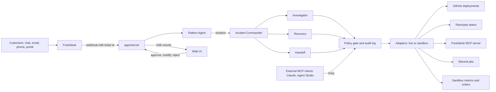

# CrisisCrew: Stage 2 design

> **Superseded in part by the pivot (2026-09-24).** [customer-harm-response.md](customer-harm-response.md) replaces the recovery design here:
> - sections 6.1 and 6.3 (the incident now ends at *recovered*, set by Recovery Coverage);
> - section 8 (per-customer impact, recovery and approvals replace the blanket credit);
> - the Freshdesk parts of section 10.5, which are now wired.
>
> Detection, root cause, the policy gate and the audit log are unchanged.

Written on 2026-09-22 as the spec for the Stage 2 build. The [build plan](build-plan.md) turns it into ordered tasks. The organizers told the team that work can happen before the event and that Stage 2 is mostly presentation; [compliance.md](compliance.md) records that. External APIs are designed here but not wired yet. Each one is listed in [`.env.example`](../.env.example) and reported as `planned` until its keys arrive.

Every threshold and weight below was checked before the event: the model and similarity against labeled pairs ([calibration.md](calibration.md)), and the thresholds by the eval in section 13 ([eval.md](eval.md)).

## As built (2026-09-23)

The system described here is built and runs in sandbox mode. Where the build differs from the plan, the sections below say so. In short:

- **Built:**
  - the detection engine, the five agents, the policy gate and hash-chained audit log, and root-cause scoring
  - the HTTP API with its event stream, the MCP server, and the React UI
  - the replay CLI, the calibration and the eval
- **Wired since the pivot:**
  - Freshdesk: webhook or poll ingest, and notes and replies through REST or Freshdesk's MCP server;
  - Freshservice incidents;
  - the Freshdesk sidebar app.

  See [customer-harm-response.md](customer-harm-response.md) section 6.
- **Not wired yet:** GitHub, Razorpay status, ElevenLabs, Claude, Sarvam and Dodo. Each is designed in section 10.5 and listed in `.env.example`. Selecting one stops the server at startup with a clear message, and `GET /api/wiring` reports it as planned.
- **Changed after calibration:**
  - Similarity is half meaning and half product area (section 5.2).
  - A question-form penalty was added to the failure score (section 5.1).
  - The model is `all-MiniLM-L6-v2` (section 5.1).
- **Changed after testing:**
  - An incident is made of the group's failure reports; questions in the group count toward the gates only (section 5.3).
  - The embedding model loads from disk first, so typed tickets work with no network (section 10.5).
- **Redesigned:** the web UI, as a production-style incident console with four pages and light and dark themes (section 10.4).
- **Not built:** the dismiss and resolve operator actions, the Eval panel in the UI, and the LLM mode.

## 1. What we're building

Customers notice outages before dashboards do. During a payment incident, the first signal is often a few complaints in different words arriving within a minute: "checkout is spinning", "UPI failed", "card rejected", "debited but no order". CrisisCrew treats that stream as incident telemetry:

1. **Detect.** Correlate incoming tickets by meaning, not keywords. Open one incident when a burst of similar failure reports is too unusual to be chance.
2. **Investigate.** Check the payment gateway, recent deployments and service error rates, then rank root-cause hypotheses by the evidence.
3. **Recover.** Link related tickets, find affected customers who haven't complained yet, send consistent updates, and send a voice update to high-impact customers who agreed to be called.
4. **Hand off.** When a proposed action exceeds the configured authority, such as a goodwill credit above ₹5,000, stop and give a human the complete case.

Stage 1 showed this loop as a scripted animation; [prototype/README.md](../prototype/README.md) lists exactly what was scripted. Stage 2 builds the loop for real.

### 1.1 What the Main Stage demo must prove

Every number is computed from data while the demo runs.

| # | What the judges see | What makes it real |
|---|---|---|
| 1 | Five complaints in different words become one incident | The correlation score and every gate's value and threshold are on screen, and the formulas are in section 5 |
| 2 | A burst that looks similar but isn't an incident gets refused | The UI shows which gate failed, for example "4 of 5 are questions, not failures" |
| 3 | The root cause names a real release | A GitHub deployment with its SHA, author and time, plus a confidence score with its evidence breakdown |
| 4 | The payment gateway is ruled out | A live call to Razorpay's public status API |
| 5 | 8 linked tickets, 15 silent customers, 23 affected in total | Computed from the ticket stream and the orders data |
| 6 | Customers get consistent updates, and one gets a voice update | A Freshdesk reply written through Freshdesk's official MCP server, plus ElevenLabs audio |
| 7 | A ₹11,500 credit (23 × ₹500) exceeds the ₹5,000 authority, so a human decides | An approval card, with the decision recorded in the audit log |
| 8 | "Prove the read-only agent can't write" | An MCP client using the Pattern Agent's token is refused, and the refusal appears in the audit log |
| 9 | Nothing is hidden | An environment box fed by `GET /api/wiring` shows which ports are live and which are sandbox |
| 10 | It isn't tuned to one example | Precision and recall over labeled scenarios, reported on a held-out split |

As built, rows 3 to 6 run against the scenario's sandbox world: the release, the gateway status, the orders and the updates are simulated. The live calls named in the right-hand column are designed (section 10.5) but not wired.

### 1.2 Out of scope

These go on the roadmap slide and won't be built: multi-tenant hosting, a database, user accounts, a real metrics system or orders database (both stay sandbox), per-organisation threshold learning, and auto-written RCA documents.

## 2. Constraints

- **Build before the event, present at it.** Per the organizers' email, the system is built ahead of Stage 2 and presented there. External APIs stay unwired until keys arrive: each is listed in `.env.example` and reported as `planned` by `GET /api/wiring`.
- **Honest by construction.**
  - No number on screen is typed in; each one traces to data and a formula in this document.
  - Every external system sits behind a port whose mode (live or sandbox) is reported.
  - A live adapter never quietly falls back to sandbox data (section 12).
- **Offline first.** With no keys set, everything runs in sandbox mode. That includes the stage, if the network fails.
- **One MacBook Air.** The demo machine is a fanless laptop, and section 11 sets the resource budget.

## 3. Architecture

### 3.1 Repository layout

```
crisiscrew/
├── prototype/            Stage 1 page, archived unchanged
├── docs/                 this design, build plan, compliance, prep, demo script
├── config/policy.json    authority levels, permissions, limits, thresholds (data, not code)
├── packages/
│   ├── contracts/        zod schemas and inferred types shared by server and web;
│   │                     the event reducer that turns events into UI state
│   ├── core/             pure logic, no I/O: enrichment, correlation, lifecycle,
│   │                     agents, root-cause scoring, policy gate, audit chain; ports
│   └── adapters/         sandbox implementations of every port, and the embedders
│                         (local model via transformers.js, cache, hash). Live adapters
│                         (freshdesk, github, razorpay-status, elevenlabs, anthropic)
│                         are designed in section 10.5, not written yet
├── apps/
│   ├── server/           composition root and the only process: config → adapters →
│   │                     engine; Hono API, SSE, MCP at /mcp, replay CLI, eval runner,
│   │                     serves the built web app (Freshdesk webhook: designed, not built)
│   └── web/              React + Vite incident console
└── scenarios/            replayable worlds (JSON) and their cached embeddings
```

**The dependency rule:** `contracts ← core ← adapters ← apps/server`, and `apps/web` depends only on `contracts`. `core` imports no SDK and does no I/O. Tickets, deployments, payment status, metrics, orders, voice, the LLM, the embedding model and the clock all reach `core` through ports, meaning interfaces that `core` defines and adapters implement.

**Toolchain:** Node 24 LTS (24.21.0) and pnpm 10.
- **Libraries:** TypeScript 5.9 in strict mode, Vitest 5, zod 4, Hono 4.13 with @hono/node-server 2, @modelcontextprotocol/sdk 1.30, @huggingface/transformers 4.3, React 19 and Vite 8. The Anthropic SDK joins when `LLM=anthropic` is wired.
- **Why Node 24:** Vitest 5 doesn't support Node 25, the version installed on the demo laptop.
- **Why TypeScript 5.9 over 7:** TypeScript 7 is the new native compiler, and a 24-hour build is no place for toolchain surprises.
- **No build step:** internal packages export their TypeScript source directly. The server runs under tsx, while Vite and Vitest compile TypeScript themselves.

### 3.2 Runtime topology

One Node process (`apps/server`) holds the engine and its in-memory state. It serves:
- the JSON API and the SSE stream for the web UI
- the Freshdesk webhook (designed, not built yet)
- the MCP endpoint at `/mcp`
- the built web app

Because there's one process, MCP tool calls, webhook ingests and UI actions all act on the same incident.



### 3.3 Wiring

Each port has one switch. An unset switch means sandbox, so the whole system runs offline with no keys.

| Port | Switch | Sandbox behaviour | Live options |
|---|---|---|---|
| tickets | `TICKETS` | tickets come from scenario replay or `POST /api/tickets` | `freshdesk`: webhook ingest, actions via Freshdesk's MCP server or REST |
| deployments | `DEPLOYMENTS` | the scenario's deployment history | `github`: the GitHub Deployments API |
| payments | `PAYMENTS` | the scenario's provider status | `razorpay-status`: Razorpay's public status API |
| metrics | `METRICS` | error rates simulated from the deployment history (section 10.5) | none planned |
| orders | `ORDERS` | the scenario's customers and payment attempts | none planned |
| voice | `VOICE` | `off`: transcript only | `elevenlabs`: text-to-speech audio |
| llm | `LLM` | `template`: deterministic text templates | `anthropic`: Claude drives the Investigator and writes drafts |
| embeddings | `EMBEDDINGS` | `local` model (default; offline once downloaded) | `hash`: fast, for unit tests only |
| credits | `CREDITS` | an in-memory ledger | `dodo`: Dodo Payments test mode (stretch) |
| translate | `TRANSLATE` | `off` | `sarvam`: translate Indic-language tickets before embedding (stretch) |

`GET /api/wiring` lists every port's mode and adapter, and the environment box in the UI's sidebar reads it. If a live adapter is selected but its credentials are missing, the server refuses to start and names the missing variable. As built, no live option is wired yet: selecting one stops startup with `adapter "<name>" is not wired yet`, and the wiring report lists it as planned. The full list of variables is in [`.env.example`](../.env.example).

### 3.4 Deployment

- **On stage:** the laptop runs the server. A Cloudflare quick tunnel (`cloudflared tunnel --url`) gives Freshdesk webhooks and remote MCP clients a public HTTPS URL. Its address goes in `PUBLIC_BASE_URL`.
- **A URL for judges (stretch):** the same server on Render or Railway, running sandbox replay. Budget at least 1 GB of RAM for the embedding model.

## 4. Domain model (`packages/contracts`)

These are the shapes shared by the server, the web app and the MCP tools. Each gets a zod schema, and its TypeScript type is inferred from the schema.

| Entity | Key fields |
|---|---|
| Ticket | id, source (`freshdesk`, `sandbox`), externalId, customerRef (email or id), customerName, channel (`chat`, `email`, `phone`, `portal`), subject, body, receivedAt, language |
| Signal | ticketId, embedding (384 numbers, kept server-side and never sent to the UI), surface and its score, failureScore, entities (payment method, amount, order id) |
| Cluster | id, memberTicketIds, reportTicketIds (the members that report a failure), cohesion and its meaning and area parts, gate results (each with value, threshold, pass and a plain reason), firstAt, lastAt, dominantSurface |
| Incident | id (`INC-2026-001` onward), status, severity, openedAt, clusterId, linkedTicketIds, hypotheses, affected (ticketed, silent), updates, approvals, credit |
| Hypothesis | id, kind (`deploy`, `provider`, `unknown`), subject (for example `checkout-service@4.21.7`), prior, evidence list, score, confidence |
| Evidence | tool, observation (structured result), likelihood ratio, explanation, adapter mode (live or sandbox) |
| Customer | ref, name, email, phone, tier (`standard`, `priority`), consent (voice, proactive) |
| Approval | id, incidentId, action, amountInr, limitInr, rationale, case summary, status (`pending`, `approved`, `modified`, `rejected`), decidedBy, decidedAt, approvedAmountInr |
| AuditEntry | seq, at, agent, tool, level, args summary, decision (`allowed`, `denied`), reason, result summary, adapter, durationMs, prevHash, hash |
| Event | seq, at, type, payload: see section 10.2 |

## 5. Detection: the Pattern Agent

### 5.1 Enrichment

Each ticket is enriched as it arrives:

- **Text.** The text is the subject plus the body, with whitespace collapsed, capped at 1,000 characters.
- **Embedding.** A 384-dimension sentence embedding, mean-pooled and L2-normalised, so the dot product equals cosine similarity.
  - **Chosen model:** `Xenova/all-MiniLM-L6-v2`, 23 MB quantized, English only. It separated labeled pairs best of five candidates and is the smallest ([calibration.md](calibration.md)).
  - **Planned first:** `Xenova/paraphrase-multilingual-MiniLM-L12-v2` (118 MB). It covers Hindi, but it misplaced checkout complaints in calibration. It stays the candidate for Hindi and Hinglish tickets, with Sarvam translation.
- **Surface.** The product area, found by comparing the embedding with a few short prototype sentences per surface. There are no keyword lists. The surfaces are `checkout_payments`, `login_account`, `delivery_orders`, `refunds_billing`, `app_performance` and `other`. A ticket gets the surface with the highest prototype similarity, or `other` below 0.35.
- **Failure score.** Similarity to failure-report prototypes ("it's not working", "payment failed", "stuck loading", "money deducted but order not placed") minus similarity to question prototypes ("how do I", "can I", "what is your policy"). A positive score means the ticket reports something broken.
  - **Question form:** a ticket phrased as a question has `questionPenalty` (0.3) subtracted. That covers a closing "?", an opening "how", "what" or "where", or an opening "can", "is" or "do" (but not "can't"). It's a soft penalty, so "Why does my payment keep failing?" still counts as a failure. Calibration added this, because embeddings alone scored "How do I apply a coupon code…?" as a failure.
- **Entities**, for evidence display only: payment method (UPI, card, net banking, wallet), amount, order id.

A ticket that describes a failure without sharing any keywords with another ticket still lands near it in embedding space. That's the inference the Stage 1 story claimed and now actually performs.

### 5.2 Similarity and clustering

- **Similarity** between two tickets = `semanticWeight` × *meaning* + (1 − `semanticWeight`) × *product area*, with `semanticWeight` = 0.5.
  - *Meaning* is the cosine of their embeddings.
  - *Product area* is the cosine of their area profiles: a softmax (temperature 0.03) over each ticket's similarity to the surface prototypes. A ticket far from every surface gets an empty profile and is matched on meaning alone.
  - Why: plain embedding cosine scored short complaints about the same failure at about 0.44, below the 0.55 gate, so the hero incident didn't fire. The hybrid lifts labeled pairs from AUC 0.94 to 1.00 ([calibration.md](calibration.md)).
- **Active window:** every ticket received in the last `window` minutes (default 15), questions included. Questions stay in so the failure-share gate can refuse a question-heavy burst visibly, rather than the burst never appearing at all.
- **Edges:** when a signal arrives, it's compared with every active signal. Pairs with similarity at or above `edgeThreshold` (default 0.50) are joined by union-find. The candidate cluster is the connected component containing the new signal.
- **Cohesion** is the mean pairwise similarity inside the cluster. It guards against chaining, where A resembles B and B resembles C but A and C are unrelated.
- **Scale:** volumes are tiny (dozens of active signals), so the exact computation is cheap. No vector database is needed.

### 5.3 Incident gates

A cluster opens an incident only when every gate passes. The UI shows each gate with its value and threshold.

| Gate | Default | Why |
|---|---|---|
| Size | at least 4 tickets in the window | two or three similar tickets happen by chance |
| Cohesion | at least 0.55 | stops unrelated failures from merging |
| Failure share | at least 75% of members have a positive failure score | a burst of questions about checkout isn't an outage |
| Burst | p at most 0.001 (see 5.4), counting only the cluster's failure reports | failures at the normal daily rate aren't an incident |

**The correlation score** on screen is the cluster's cohesion, shown as a percentage, with a threshold marker on the bar. It isn't a probability, and the UI labels it "similarity". Each gate's result is shown next to it.

**Membership:** the incident is made of the group's failure reports (`reportTicketIds`). Questions in the group count toward the size and failure-share gates, but they aren't linked, messaged or counted as affected. Rehearsal found the need for this: a question typed during a burst was being sent an outage update.

If an incident is already open, a new failure report joins it instead of starting a second one. It joins when its similarity to the incident's centroid (the mean of member embeddings) is at least `joinThreshold` (default 0.50). The Recovery Agent then links it (section 8.1).

### 5.4 Baseline and the burst test

- **Baseline.** For each surface, the normal rate λ of failure reports is the higher of two numbers: the world's stated normal volume for that surface (never below the floor of 3 an hour, or 0.05 a minute), and the failure reports actually seen in the hour before the group started. The floor stops an empty history from making everything look unusual.
- **The test.** For a cluster with n failure reports spanning t minutes (minimum 1), p = P(N ≥ n) under a Poisson distribution with mean λ·t.
- **Worked example.** Five failures in 30 seconds on a surface that normally sees 3 an hour gives p ≈ 2.5 × 10⁻⁹.
- **Display.** The UI turns p into plain words: "about 1 in 400 million under normal volume".

This is a simple model, and the doc says so. The eval (section 13) measures how often it fires falsely on scenarios with no incident in them.

### 5.5 What the UI shows for a refused cluster

Restraint is part of the product. The correlation panel always shows the strongest current cluster, even a pair, with all four gates, so a refusal is as visible as a detection. Failing gates are shown in amber with a plain reason:
- "4 of 5 are questions, not failures"
- "these complaints are about different things (similarity 0.31, needs 0.55)"
- "only 2 tickets in this group (needs 4)"

## 6. Incident lifecycle and agents

### 6.1 States

`detected → investigating → root_cause_identified → recovering → awaiting_approval → recovered → resolved`

*Since the pivot:* the incident reaches `recovered` only when Recovery Coverage is 100%. It's `awaiting_approval` while any customer's credit waits for a human (see [customer-harm-response.md](customer-harm-response.md) section 4).

Two exits skip the normal path:
- `dismissed`: an operator marks a false positive. It's recorded and counted in the eval.
- If no credit needs approval, `recovering` goes straight to `recovered`.

`resolved` is set manually by the operator. As built, there's no operator action for `dismissed` or `resolved` yet; a session ends at `recovered`, `awaiting_approval`, or `recovering` when an action needs attention.

Severity follows a documented rule, set when the incident opens: `high` when the surface is `checkout_payments`, and `medium` otherwise. (The planned "more than 20 affected" rule would need severity to change after opening, which isn't built.)

### 6.2 Agents and trust boundaries

The agents are split by permission scope, not by convenience. Each agent is a separate identity with its own allow-list, and it can only reach tools through the policy gate (section 9).

| Agent | Job | Highest level | Tools it may call |
|---|---|---|---|
| Pattern Agent | score tickets and propose clusters | L0 read | `search_recent_tickets`, `get_incident` |
| Incident Commander | open incidents, route work between agents | L1 limited write | `open_incident`, `get_incident`, `search_recent_tickets` |
| Investigator | gather evidence and rank root causes | L0 read | `get_payment_health`, `get_recent_deployments`, `get_service_status`, `get_incident` |
| Recovery Agent | link tickets, find affected customers, update customers, propose credits | L2 customer contact | `identify_affected_customers`, `link_ticket_to_incident`, `draft_customer_update`, `send_customer_update`, `propose_recovery_credit`, `issue_recovery_credit` (only within authority), `get_incident` |
| Handoff Agent | build the case and request approval; carry out approved actions | L3 with approval | `request_human_approval`, `issue_recovery_credit` (only with an approved approval), `get_incident` |
| operator | external MCP clients: Claude Desktop, Agent Studio, MCP Inspector | L0 read | read tools only |

The human approver isn't an agent. Decisions arrive through the approvals API with the approver token.

### 6.3 Orchestration

The Commander drives the state machine:

1. The Pattern Agent's cluster passes every gate. The Commander calls `open_incident`, and the status becomes `detected`.
2. The Investigator (root cause) and the Recovery Agent (`identify_affected_customers`, linking) start **in parallel**, and the status becomes `investigating`. These are two agents running concurrently, each shown live in the UI.
3. The root cause reaches the confidence floor (default 0.6), or the Investigator finishes. The status becomes `root_cause_identified`.
4. The status becomes `recovering`. The Recovery Agent runs its recovery pass:
   1. rebuild the impact graph;
   2. `plan_recovery` for every affected customer;
   3. carry out the actions within its authority.
5. For each credit above authority, the Handoff Agent builds that customer's case and calls `request_human_approval`. The status becomes `awaiting_approval`.
6. The approver decides, one customer at a time.
   - On approve or modify, the Handoff Agent calls `issue_recovery_credit` for that customer, with the approval id.
   - On reject, nothing is issued, and the decision is recorded.
   - When coverage reaches 100%, the status becomes `recovered`.

*Since the pivot:* the full design is in [customer-harm-response.md](customer-harm-response.md) section 5.

### 6.4 Two modes: template and LLM

As built, only template mode exists. The LLM mode below is designed, not wired.

| | `LLM=template` (default, offline) | `LLM=anthropic` |
|---|---|---|
| Investigator | calls all three evidence tools in parallel | Claude chooses which tools to call through the SDK's tool runner. It only sees the Investigator's tools, and each call goes through the gate |
| Customer updates | deterministic templates | Claude writes them from structured facts as structured output: subject, body, voice script |
| Handoff case | template | Claude summarises the case for the approver |
| Confidence numbers | computed by the engine (section 7) | the same: always computed by the engine from recorded evidence, never taken from the model's text |

In both modes, customer-facing text reaches customers only through `send_customer_update`, which is an L2 tool. Every draft is labeled with its source (`template` or `claude-opus-5`).

## 7. Investigation and root cause

### 7.1 Hypotheses

When an incident opens, the Investigator creates three kinds of hypothesis:
- **deploy:** one for each deployment in the last 6 hours, of each service mapped to the incident's surface. For example, `checkout-service` maps to `checkout_payments`.
- **provider:** one for each payment provider the checkout uses.
- **unknown:** always present, so confidence can never reach 100% by elimination.

### 7.2 Evidence and likelihood ratios

Every tool result becomes evidence with a likelihood ratio (LR). All LRs and priors live in `config/policy.json` and are shown in the UI's breakdown.

| Evidence | Applies to | LR |
|---|---|---|
| Deploy gap g, from the release to the first complaint | deploy | 6 if 0 < g ≤ 30 min · 3 if 30 min < g ≤ 2 h · 0.5 if g > 2 h · 0.2 if the release came after the first complaint |
| Error-rate ratio r (section 10.5) | deploy | min(r, 10) if r ≥ 2 · 1 if 1.2 ≤ r < 2 · 0.3 if r < 1.2 |
| Provider status | provider | 0.1 if operational · 8 if degraded or in an incident · 1 if the check failed |
| Payment-method spread in the complaints | provider | 2 if at least 80% name one method (such as UPI) · 0.7 if spread across methods |

Priors: deploy 0.50 (split evenly across candidate releases), provider 0.25, unknown 0.25. Deploys get the largest share because most outages follow a change to a live system; Google's SRE book puts it at roughly 70%.

### 7.3 Confidence

A hypothesis's score is its prior multiplied by the LRs of its evidence. Confidence is its score divided by the sum of all scores.

A missing check is listed as "not checked" and contributes no LR, so it neither helps nor hurts.

These are **uncalibrated defaults**, and the UI and pitch say so: they encode stated assumptions, not frequencies learned from real incidents. Learning them from confirmed and rejected incidents is on the roadmap. Changing a value in `policy.json` changes the result, and the eval shows the effect.

Worked example with the hero scenario's world, as the engine computes it:
- **Two candidate releases** share the 0.5 deploy prior, so each starts at 0.25.
- **v4.21.7:** a 14-minute gap (LR 6) and an error ratio of about 8.5 (LR ≈ 8.5) give 0.25 × 6 × 8.5 ≈ 12.7.
- **v4.21.6:** shipped 5 hours earlier (LR 0.5), with no error change (LR 1), gives 0.125.
- **Provider:** Razorpay operational (LR 0.1) and complaints spread across UPI and cards (LR 0.7) give 0.25 × 0.1 × 0.7 ≈ 0.018.
- **Unknown:** 0.25.
- **Result:** v4.21.7 gets 97% of the total, with every factor visible. The simulated error ratio varies slightly with replay timing (8.4× to 8.6×); the ranking doesn't.

In the UPI provider-outage scenario, the provider hypothesis wins instead, which shows the engine doesn't always blame the last deploy.

### 7.4 LLM mode (designed, not wired)

The Investigator uses Claude to choose which checks to run and to explain them in plain words.
- **Setup:** the `anthropic` adapter uses the SDK's tool runner, with `betaZodTool` definitions and `client.beta.messages.toolRunner`. Each tool's run function calls the policy gate as the Investigator.
- **Output:** Claude's final message becomes the investigation narrative. The ranking and confidence still come from section 7.3.
- **If Claude skips a check,** that evidence shows as "not checked".

## 8. Recovery and handoff

> **Superseded by the pivot.** Sections 8.2 to 8.5 describe the original blanket credit (₹500 × every affected customer, one approval for the total). The system now works customer by customer:
> - a customer is affected only with a failed or pending payment in the window, so a complaint alone is *not verified*;
> - each customer gets their own plan and credit;
> - each credit above authority gets its own approval.
>
> See [customer-harm-response.md](customer-harm-response.md) sections 2 to 4. The text below is kept as the record of the Stage 2 design.

### 8.1 Linking

Every ticket in the incident cluster, and every later ticket that joins (section 5.3), is linked by the Recovery Agent through `link_ticket_to_incident` (L1).
- **Freshdesk, live mode:** the link is a private note on the ticket ("Linked to INC-2026-001: checkout failures after checkout-service v4.21.7").
- **Sandbox (as built):** it's recorded in memory.

### 8.2 Affected customers

`identify_affected_customers` asks the orders port for customers with a failed or pending payment attempt since a start time. It runs twice:
- **At first**, in parallel with the investigation, from 30 minutes before the first complaint.
- **Again** once the root cause is identified, if the leading hypothesis is a release that shipped earlier than that. Its deploy time becomes the new start.

Then:
- **affected** = customers with such attempts, plus every customer who filed a linked ticket
- **silent** = affected customers who didn't file a ticket

In the hero scenario: 8 ticketed + 15 silent = 23 affected.

### 8.3 Updates and voice

- **Ticketed customers** get a reply on their ticket. In live mode, that's Freshdesk `replyTicket` through Freshdesk's MCP server.
- **Silent customers** with proactive-contact consent get the same message through the sandbox notification channel. Sending real email to invented customers would be wrong.
- **Priority customers** who have agreed to voice contact also get an ElevenLabs audio version of the update, which plays in the UI. As built, voice is off: the script is written and marked *prepared*, and no audio is generated.
- Every message comes from one draft, so everyone hears the same story.

### 8.4 Credit and authority

`propose_recovery_credit` computes credit per customer (₹500, from policy) × affected customers (23) = ₹11,500. The authority limit is ₹5,000.
- **Within the limit:** `issue_recovery_credit` runs at L2 and the Recovery Agent may call it.
- **Above the limit:** the same tool runs at L3 and needs an approved approval record whose amount matches.
- **Why it matters:** the tool's authority level depends on its arguments, which is what "calibrated authority" means in practice.

### 8.5 Approval

`request_human_approval` (L1, Handoff Agent) creates an approval containing:
- the action and amount
- the limit it exceeds
- the root cause with its confidence and evidence
- the affected counts
- the actions already taken
- the recommendation

The approver has three choices:

| Decision | Effect |
|---|---|
| Approve | the Handoff Agent issues ₹11,500 through `issue_recovery_credit` with the approval id |
| Modify (for example to ₹5,000) | the approval records the new amount. The gate refuses any execution that doesn't match it, so the original ₹11,500 can't go through |
| Reject | nothing is issued, and updates continue |

## 9. Policy gate and audit log

### 9.1 Authority levels

| Level | Meaning | Allowed when |
|---|---|---|
| L0 read | reads data | the caller's allow-list includes the tool |
| L1 limited write | internal or reversible changes: incident records, links, notes, drafts, proposals | allow-listed and within limits |
| L2 customer contact | messages customers or makes changes that affect them | allow-listed and the consent rules pass: reply to a customer's own ticket, voice only with voice consent, proactive messages only with proactive consent, credits only within authority |
| L3 human approval | high-risk actions | allow-listed and backed by an approved approval whose arguments match |

### 9.2 Enforcement

- **No other route to adapters.** Agents never hold adapters. Each agent gets a tool client bound to its identity, and the gate is the only code that invokes tool implementations.
- **Each call is checked in order:** identity, then allow-list, then effective level, then the level's condition. Every call produces one audit entry. A refused call is appended immediately, and an allowed call is appended when it completes, with its result or error. The log is append-only.
- **MCP gets the same enforcement.** A bearer token maps to an identity, `tools/list` returns only that identity's tools, and a `tools/call` for anything else is refused by the gate and audited.
- **The permission matrix is visible.** `GET /api/policy` and a UI panel show the agents × tools matrix computed from the same `policy.json` the gate enforces, so what judges see is what runs.

### 9.3 Audit log

- Every entry records the fields listed in section 4, hash-chained: each entry includes the SHA-256 of the previous one, so any edit breaks the chain.
- Entries are kept in memory for the UI and appended to `data/audit/<run>-<session>.jsonl`. Each session (a replay, or a live session) is its own chain.
- `GET /api/audit/verify` re-walks the chain and reports the result, and the UI shows it as a badge.
- Entries hold ticket and customer references and short summaries, not full ticket bodies.

## 10. Interfaces

### 10.1 HTTP API

| Method and path | Auth | Purpose |
|---|---|---|
| `GET /api/health` | none | liveness and version |
| `GET /api/wiring` | none | each port's mode (live, sandbox, off) and adapter detail |
| `GET /api/state` | none | snapshot for the UI: `seq`, tickets, clusters, incidents, agents, approvals |
| `GET /api/stream` | none | SSE event stream; resumes from `Last-Event-ID` |
| `POST /api/webhooks/freshdesk` | `X-CrisisCrew-Secret` header | Freshdesk automation webhook; the body carries only the ticket id. **Designed, not built** |
| `POST /api/tickets` | admin token | manual ticket ingest for sandbox runs |
| `POST /api/replay` | admin token | start a scenario replay: `{scenario, speed}` (the planned `target: "freshdesk"` isn't built) |
| `POST /api/live` | admin token | start a fresh live session on the hero's world, for typed tickets |
| `GET /api/scenarios` | none | list scenarios and their expected outcomes |
| `POST /api/approvals/:id` | approver token | `{decision: "approve" or "modify" or "reject", amountInr?, note?}` |
| `GET /api/audit` | none | audit entries, filterable by agent and decision |
| `GET /api/audit/verify` | none | hash-chain check |
| `GET /api/policy` | none | permission matrix and limits |
| `GET /api/voice/:id` | none | generated audio (`audio/mpeg`); as built, it answers 404 because voice is off |
| `POST /api/admin/reset` | admin token | clears state between rehearsals; deliberately absent from the UI |
| `POST, GET, DELETE /mcp` | bearer token | MCP Streamable HTTP endpoint (section 10.3) |
| `GET /*` | none | the built web app |

Tokens are compared in constant time, and the web UI asks for the approver token the first time it's needed. As built, the admin and approver tokens are optional: when `ADMIN_TOKEN` or `APPROVER_TOKEN` is unset, those routes are open, which suits a local demo and must change before exposing the server.

### 10.2 Event stream

- The server keeps an in-memory log of typed events, each with a monotonic `seq`.
- The UI loads `GET /api/state`, then opens the SSE stream from that `seq`.
- A reducer in `contracts` applies each event to the state. The server and the web app use the same reducer, so they can't disagree.

| Event | Payload |
|---|---|
| `ticket.received` | ticket |
| `signal.scored` | ticket id, surface, failure score, nearest neighbours |
| `cluster.updated` | cluster with gate results |
| `incident.opened` | incident |
| `incident.status_changed` | from, to, reason |
| `agent.status` | agent, `idle` or `working` or `done`, current task |
| `tool.called` | audit entry (allowed or denied) with duration and adapter mode |
| `evidence.recorded` | hypothesis id, evidence |
| `rootcause.ranked` | hypotheses with scores and confidence |
| `ticket.linked` | ticket id, incident id |
| `customers.identified` | ticketed, silent, affected counts and references |
| `update.drafted` / `update.sent` | customer, channel, text, source, adapter |
| `voice.ready` | customer, audio id, adapter |
| `approval.requested` / `approval.decided` | approval |
| `credit.issued` | amount, approval id, adapter |
| `replay.started` / `replay.finished` | scenario id |

### 10.3 MCP server

- **Endpoint:** `/mcp`, stateless Streamable HTTP, using the SDK's `WebStandardStreamableHTTPServerTransport` so it plugs straight into Hono.
- **Auth:** the bearer token picks the identity (the `MCP_TOKEN_*` variables). The identity reaches tool handlers through the transport's `authInfo`.
- **Tools:** the names match the Stage 1 write-up, so the story and the system line up.

| Tool | Level | Identities |
|---|---|---|
| `search_recent_tickets` | L0 | pattern, commander, operator |
| `get_incident` | L0 | all |
| `get_payment_health` | L0 | investigator, operator |
| `get_recent_deployments` | L0 | investigator, operator |
| `get_service_status` | L0 | investigator, operator |
| `identify_affected_customers` | L0 | recovery |
| `open_incident` | L1 | commander |
| `link_ticket_to_incident` | L1 | recovery |
| `draft_customer_update` | L1 | recovery |
| `propose_recovery_credit` | L1 | recovery |
| `request_human_approval` | L1 | handoff |
| `send_customer_update` | L2 | recovery |
| `issue_recovery_credit` | L2 within authority, L3 above | recovery (L2), handoff (L3 with approval) |

**The denial demo:** connect MCP Inspector or Claude Desktop with the Pattern Agent's token, then call `link_ticket_to_incident`. The call is refused, and the refusal appears in the audit log. The same gate protects the internal agents.

### 10.4 Web UI

The first plan reused the Stage 1 page's visual system. As built, the UI is a new design: a production-style incident console. It uses neutral surfaces, with colour only where it means something:
- red for incidents and refusals
- amber for a decision waiting on a human
- green for checks that passed
- one blue for the primary action

It's light by default, with a dark mode that the viewer's browser remembers. There's no timeline animation, fake timer or reset button: everything on screen comes from events. Pages are addressed by the URL hash, so a reload keeps the page.

| Part | Shows |
|---|---|
| Sidebar | the four pages, with counts and a dot while an incident is open; the environment (live, sandbox and off counts, and per-port detail from `GET /api/wiring`); the connection; the theme switch |
| Top bar | breadcrumb with the incident id; session state ("Replaying at 2×", "Replay finished", "Live session"); scenario and speed; Run replay; Live mode |
| Incident page | a note on the running scenario and its expected outcome; the header (title from the product area, status, severity, time opened, tickets, customers affected, likely cause); a progress stepper; key numbers; **Detection** (similarity with its meaning and area parts and the threshold marker, the four gates with plain reasons, and the verdict); **Root cause** (hypotheses with priors, likelihood ratios and sources); **Customer impact** (affected split, update counts by channel, the single update, the voice script, and the updates table); the **Decision required** card (approve, modify with an amount, reject, with a note for the audit record); **Incoming tickets** with a box for typing one; the timeline; recent agent activity |
| Tickets page | every ticket with time, customer, channel, message, product area, failure or question, and incident, filterable, plus the typing box |
| Agents page | each agent's highest authority, status, current task and last tool; every tool call with level, adapter, decision and result |
| Governance page | the audit log with the chain-verified badge and a filter for refused calls; the permissions matrix from `GET /api/policy` |
| Eval | not in the UI: the eval lives in [eval.md](eval.md) |

### 10.5 Integrations

Everything in this section except the embeddings is designed but not wired yet. The variables are listed in `.env.example`.

**Freshdesk** (`TICKETS=freshdesk`)
- **Ingest:**
  - **Webhook:** a Ticket Creation automation rule triggers a webhook. It POSTs to `{PUBLIC_BASE_URL}/api/webhooks/freshdesk` as JSON with the body `{"ticket_id": {{ticket.id}}}` and a custom header `X-CrisisCrew-Secret`. The server checks the secret, returns 202, then fetches the ticket with `GET /api/v2/tickets/{id}?include=requester`.
  - **Why only the id:** putting ticket text into a JSON template breaks the JSON as soon as a customer types a quote mark.
  - **Idempotent:** ingest is keyed by ticket id. Freshdesk retries failed webhooks every 30 minutes, so late duplicates are recorded and not re-correlated.
  - **Poll fallback** (`FRESHDESK_INGEST=poll`): `GET /api/v2/tickets?updated_since=…&order_by=created_at&order_type=asc&per_page=100` every 15 seconds.
  - **Limits:** 50 REST calls a minute on trial accounts and 1,000 webhook calls an hour.
- **Actions** (`FRESHDESK_ACTIONS=mcp`, or `rest` as fallback):
  - **MCP route:** the Recovery Agent's writes go through Freshdesk's official MCP server at `https://<domain>/mcp`. Auth is the header `Authorization: <API key>`, and the tools are `createTicketNote` (private link note) and `replyTicket` (customer update).
  - **Quota:** 100, 500 or 1,000 MCP actions a month on Growth, Pro or Enterprise. The UI shows a quota meter counting actions used.
  - **REST route:** `POST /api/v2/tickets/{id}/notes` and `/reply`.
  - **Use REST for rehearsals** and MCP for the final demo.
- **Replay into Freshdesk** (`POST /api/replay` with `target: "freshdesk"`): creates the scenario's tickets as real Freshdesk tickets via `POST /api/v2/tickets`, at the scenario's timing. They come back through the real webhook path.
  - Channels map to Freshdesk sources: email 1, portal 2, phone 3, chat 7.
  - Requesters are the team's own email addresses, listed in the scenario's customer data.

**GitHub deployments** (`DEPLOYMENTS=github`)
- **Endpoints:**
  - `GET /repos/{owner}/{repo}/deployments?environment=production&per_page=20`
  - `…/deployments/{id}/statuses` for the latest state
  - `…/commits/{sha}` for the message and author
  - Headers: `Accept: application/vnd.github+json` and `X-GitHub-Api-Version: 2022-11-28`
- **Service mapping:** `GITHUB_DEPLOY_REPOS` maps each service to a repo, for example `checkout-service=OWNER/checkout-service`.
- **Version:** read from `payload.version`, falling back to `description`.
- **On stage:** a small demo repo gets a real deployment created live with `gh api`, which is the "ship a release" beat.

**Payment health** (`PAYMENTS=razorpay-status`)
- `GET https://status.razorpay.com/api/services` is public and needs no key. It returns services with `online`, `online_24_hours`, `failures_24_hours` and `incidents`.
- "Payments API" and "Checkout" map to operational or degraded.
- Results are cached for 60 seconds.
- This reflects Razorpay's platform, not a particular merchant's integration, and the evidence text says so.

**Metrics** (sandbox only)
- The simulated error rate is derived from the deployment history the deployments port returns. A release that the scenario marks faulty (4.21.7) raises the error rate from its deploy time, with seeded noise.
- With `DEPLOYMENTS=github`, the simulated spike therefore lines up with the real deployment. It's still simulated and labeled sandbox.
- The ratio r is the mean error rate from the release to now, divided by the mean over the 60 minutes before the release.

**Orders** (sandbox only): customers, consent flags and payment attempts from the scenario, relative to the scenario's clock or to the real deploy time.

**ElevenLabs** (`VOICE=elevenlabs`)
- **Request:** `POST https://api.elevenlabs.io/v1/text-to-speech/{ELEVENLABS_VOICE_ID}?output_format=mp3_44100_128`, with header `xi-api-key` and body `{text, model_id, language_code}`.
- **Model:** default `eleven_flash_v2_5`: about 75 ms latency, 32 languages including Hindi.
- **Storage:** audio goes to `data/voice/` and is served from `/api/voice/:id`.
- **Stretch:** a real phone call through `POST /v1/convai/twilio/outbound-call`, which needs an ElevenLabs agent and a Twilio number.

**Claude** (`LLM=anthropic`)
- **SDK and model:** `@anthropic-ai/sdk` with model `claude-opus-5` (set by `ANTHROPIC_MODEL`).
- **Effort:** `low` for drafts and the case summary, `medium` for the Investigator.
- **Structured output:** via `client.messages.parse` with `output_config.format` (zod).
- **Refusals:**
  - Check `stop_reason` for `refusal`.
  - Enable server-side fallbacks (`fallbacks: "default"` with the `server-side-fallback-2026-07-01` beta).
- **Limits:** 20-second timeout, 1 retry.
- **Failure:** on timeout or error, the step uses its template and is labeled "template (LLM unavailable)".
- **Caching:** these prompts are shorter than the minimum cacheable prefix, so prompt caching isn't used.

**Embeddings** (`EMBEDDINGS=local`)
- **Loading:** transformers.js `pipeline("feature-extraction", …)` with mean pooling and normalisation, loaded lazily on first use.
- **Offline:** the model is read from `EMBEDDINGS_MODEL_DIR` (default `.models/`) first, and downloaded only when it isn't there. transformers.js 4.3 checks for tokenizer files ignoring `cache_dir`, so the library's default cache is also pointed at that folder; otherwise it goes to the network even with the model on disk. This was verified with the server's network blocked.
- **Caching:** embeddings are cached by model id and SHA-256 of the text. Scenario texts are cached in `scenarios/.embeddings/` and committed, so CI and tests never load the model.
- **Threads:** the ONNX runtime is limited to 2 threads (section 11).

**Stretch ports:** `TRANSLATE=sarvam` (Sarvam translation for Hindi and Hinglish tickets) and `CREDITS=dodo` (a Dodo Payments test-mode transaction when a credit is approved). Both have their variables in `.env.example` and nothing else until the core is done.

## 11. Resource budget (MacBook Air)

The demo runs on a fanless MacBook Air, so the design keeps load low and steady:

- **One server process** for the engine, API, MCP and static UI. The Vite dev server runs only while working on the UI, and the demo uses the production build.
- **Memory:** the server stays under about 500 MB with the quantized model loaded (measured at about 400 MB), and the whole stack under about 1 GB, excluding the browser.
- **CPU:**
  - The model loads once, lazily. Embeddings are batched per ingest burst and cached.
  - ONNX runs with 2 intra-op threads, so bursts don't max out the cores and trigger thermal throttling.
- **No Docker, no database, no GPU.** State is in memory, plus JSONL files under `data/`.
- **Tests:**
  - Unit tests use `EMBEDDINGS=hash` or the committed embedding cache, so they never load the model.
  - Run `vitest run` for the package being changed, not a repo-wide watcher.
- **Disk:** 23 MB for the chosen model. pnpm's content-addressed store keeps `node_modules` small.

## 12. Error handling

| Failure | Behaviour | What the UI shows |
|---|---|---|
| Live adapter selected, credentials missing | the server refuses to start and names the variable | none |
| A live tool call fails or times out (5 s default) | the tool returns a typed error, which is audited. Root-cause scoring treats it as "not checked" | the tool call in red with the reason. The port stays live, with no silent switch to sandbox |
| Claude times out, errors or refuses | that step uses its template | text labeled "template (LLM unavailable)" |
| Webhook has a bad secret | 401, logged | none |
| Webhook for a ticket already ingested | ignored (idempotent) | none |
| Freshdesk MCP quota exhausted | the action fails visibly. The operator restarts with `FRESHDESK_ACTIONS=rest` | quota meter at the limit |
| Embedding model can't load | as built, the server still starts, because prototypes and scenarios are served from the committed cache. A typed ticket that needs the model fails, and the next one tries loading again | the ticket can't be sent |
| SSE disconnect | the browser reconnects and sends `Last-Event-ID`, and the server replays newer events | a brief "reconnecting" chip |
| Gate refusal | audited, and the caller gets a refusal result, not an exception | highlighted in the audit panel |

## 13. Testing and evaluation

**Tests** (Vitest) cover these areas:

| Area | What's tested |
|---|---|
| `core` units | cosine similarity and cohesion; union-find clustering; each gate; the Poisson tail; LR scoring and confidence; the policy decision matrix for every agent and tool; the hash chain, including tamper detection; lifecycle transitions; credit maths |
| Scenarios | each scenario replays on a virtual clock with sandbox adapters and cached embeddings. The hero fires with 8 linked tickets, 23 affected (15 silent), a ₹11,500 approval and the deploy root cause. The UPI outage fires with the provider root cause. The three look-alike scenarios don't fire, each failing on its expected gate. The quiet day never fires |
| Adapters | the embedding cache and loader (disk first, no network needed once downloaded). Recorded fixtures for the live adapters come with the adapters |
| API | Hono's `app.request`: webhook secret check, idempotency, the first SSE events, approval decisions |
| MCP | the SDK `Client` over `StreamableHTTPClientTransport`, with a custom `fetch` that calls the Hono app in-process: per-identity `tools/list`, an allowed call, and a refused call that's audited |
| Web | the shared reducer; the UI itself is checked by hand |

**The eval** (`pnpm eval`; results in [eval.md](eval.md)):
- **Data:** 60 scenario runs made by seeded sampling from hand-written paraphrase pools (144 sentences).
  - 30 runs contain an incident, across three kinds: a checkout release bug, a UPI provider outage and a login OTP outage.
  - 30 don't: quiet hours, look-alike question bursts, and scattered failures.
  - A separate stress test mixes different delivery problems in one area, a known hard case.
- **Held-out split:** thresholds are tuned on one half, and the results reported are from the other.
- **Report:**
  - incident-level precision and recall at the chosen thresholds
  - ticket-level linking precision and recall
  - detection latency (tickets and seconds from the first incident ticket)
  - a threshold sweep table
- **Honesty:** the report states plainly that this is synthetic, labeled, hand-written data, not production traffic.

## 14. Security and privacy

- Secrets live only in `.env`, which git ignores. `.env.example` lists the names with empty values.
- The webhook uses a shared secret. MCP uses one bearer token per identity, and mutations need the admin or approver token. All comparisons are constant-time.
- When `/mcp` is served on localhost, it uses `allowedHosts` and DNS rebinding protection. CORS allows only the web origin.
- Data is minimised:
  - The audit log stores references and summaries.
  - Voice contact requires the customer's voice-consent flag, and proactive messages require proactive consent. This reflects consent expectations under India's DPDP Act.
  - Ticket text goes to Claude only when `LLM=anthropic`, and the environment box in the UI shows when it does.

## 15. Risks

| Risk | Mitigation |
|---|---|
| Venue network is flaky | everything runs in sandbox mode offline. The model is pre-downloaded, and a phone hotspot is the backup for live calls |
| Freshdesk trial has no MCP access, or runs out of quota | `FRESHDESK_ACTIONS=rest`; REST for rehearsals |
| Webhook can't reach the laptop | `FRESHDESK_INGEST=poll` |
| The model clusters poorly on real wording | calibration before the event (the hybrid similarity), the eval to show where it stands, and the stress test to show where it doesn't |
| Claude is slow or refuses | effort `low` or `medium`, server-side fallbacks, labeled templates |
| Running out of time before the event | milestones are ordered so each one leaves a working demo; the live adapters are independent and can be added one at a time |
| MacBook Air throttles | the section 11 budget; the production build for the demo; laptop plugged in |
| Toolchain surprises (Node 25, TypeScript 7) | pinned to Node 24 LTS and TypeScript 5.9 |
| A judge asks "is this live?" | the environment box in the UI, audit verification and this document answer it |

## 16. Stretch goals, in order

1. **Agent Studio.** If the organizers provide Freshservice Agent Studio with the MCP Gateway, register `/mcp` with the operator token. This is configuration only.
2. **Replay into real Freshdesk tickets.** Real tickets go through a real webhook on stage (section 10.5).
3. **A real voice call** to a teammate's verified phone, via the ElevenLabs outbound-call API and Twilio.
4. **Sarvam translation,** plus a Hinglish ticket in the hero scenario.
5. **Dodo Payments test-mode credit** on approval.
6. **A public judge URL** on Render or Railway.
7. **A post-incident summary** drafted from the audit trail.

## Appendix: scenarios

Scenarios are JSON files in `scenarios/`, validated by a zod schema. Times are relative, such as "−14m" or "+30s". A scenario contains:
- **identity and labels:** an id, a title, its purpose, and the expected outcome (used by tests and the eval)
- **a world:**
  - services and their surfaces
  - deployments, each with version, SHA, author, relative time and a faulty flag
  - baseline error rates
  - payment providers and their status
  - customers with tier and consent
  - payment attempts
- **tickets,** each with a relative time, customer, channel, subject and body
- **optional background traffic** drawn from a shared pool of benign tickets at a set hourly rate, with a seed

| Scenario | What happens | Expected |
|---|---|---|
| `checkout-v4.21.7` (hero) | `checkout-service` v4.21.7 ships 14 minutes before the first complaint. The five Stage 1 complaints arrive within 30 seconds, and three more follow during the investigation. 23 customers have failed payment attempts after the release; 8 of them file tickets. Two of the 15 silent customers are priority tier with voice consent. Razorpay is operational | incident; deploy root cause; 8 linked, 23 affected, 15 silent; 2 voice updates; ₹11,500 needs approval |
| `upi-provider-outage` | no release in 6 hours; the provider is degraded for UPI; 6 UPI-specific failures in 2 minutes | incident; provider root cause |
| `lookalike-checkout-questions` | 5 checkout questions ("can I pay by UPI at checkout instead of using a card?") and 1 failure report in 8 minutes | no incident; the failure-share gate refuses it: "4 of 5 are questions, not failures" (one question is tagged refunds and billing, so the group has 5) |
| `scattered-failures` | 5 failures in 10 minutes about different things: login OTP, late delivery, refund, app crash, wrong item | no incident; no group grows past 2 similar tickets, so the size gate refuses it |
| `two-card-complaints` | "charged twice for my subscription" and "how do I remove a saved card?" | no incident; the size gate refuses it (their similarity is 0.26) |
| `quiet-day` | two hours of normal background traffic, replayed at 20× | no incident |

The hero's first five tickets reuse the Stage 1 wording, which is Stage 1 material:
1. "My checkout keeps loading forever."
2. "UPI isn't working. Tried twice."
3. "Payment failed but bank shows debit."
4. "Card rejected on checkout — card is fine."
5. "Can't complete payment for my order."

Everything else in the scenarios was written for this project before the event.
