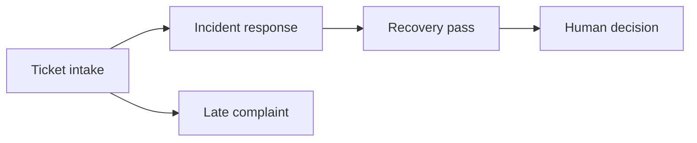

# Agent workflows and traces

CrisisCrew's agents run as **LangGraph** graphs, and every run of a graph is a **trace**: its nodes, and every policy-gate tool call, guard check and classifier call inside them. The **Traces** page shows each trace step by step. The same traces go to **LangSmith** when a key is set. Either way, a refused call, a flagged input or a failure is marked, and the trace opens at it.

## The workflows

Five workflow entry points run through LangGraph, one compiled graph per invocation. Each graph has a single orchestration node. The agent operations inside that node emit separate spans, including policy-gate calls and guard checks. `GET /api/workflows` returns the five entry-point shapes for the Traces page.



| Workflow | Runs | Nodes (agent) |
|---|---|---|
| Ticket intake | for every ticket | classify and correlate; nested guard and classifier spans |
| Incident response | once per incident | respond; nested open, investigate, impact, engineering and recovery spans |
| Recovery pass | after the root cause and for later complaints | recover; nested planning, outreach, approvals, write-back and settle spans |
| Late complaint | for a complaint that joins an open incident | link and recover |
| Human decision | when an approver decides one customer's credit | settle decision |

The existing agent functions decide the order inside each orchestration node. Incident investigation and impact assessment still run in parallel. Every action still goes through the policy gate.

**One pass at a time per incident:** the recovery pass runs inside the incident's serial chain, so two passes never plan or pay the same thing.

## What a trace records

| Span kind | What it is | Recorded |
|---|---|---|
| workflow | one graph run, or a nested one (the recovery pass inside an incident) | its input, and the outcome in one line |
| node | the LangGraph orchestration node or a nested agent step | the state it read, and what it returned |
| tool | one policy-gate call | the arguments; the result or the refusal; the audit entry, authority level and adapter |
| guard | one prompt-guard check | the text screened, the verdict, the reasons |
| classifier | one Laya call | the text, the labels and probabilities, the checkpoint, the latency |

**Nesting follows async context** (`AsyncLocalStorage`), so a gate call made deep inside an agent lands under the node that made it, with no tracing code in the agents.

**Status of a span:**
- *ok*;
- *refused*: the policy gate denied the call;
- *flagged*: the prompt guard found instruction-like text;
- *fell back*: a classifier or guard didn't answer, and the built-in one did;
- *error*.

**Status of a trace:**
- **ok**;
- **needs attention**: something was refused, flagged or fell back;
- **error**.

The **first problem** is the most serious one, and the earliest among equals. It's what the trace opens at.

**Links between traces:** a trace started from inside another is linked to it, not nested in it. For example, the incident trace records the ticket trace that opened it (`parentTraceId`).

**Redaction:** inputs and outputs are redacted before any sink sees them:
- secrets: bearer tokens, keys, long hex strings, fields named like a key or token;
- emails and UPI IDs;
- card numbers, phone numbers, PAN and Aadhaar-like numbers.

Names and customer refs stay, so a trace is still readable. Payloads are clipped: long strings, long arrays, deep nesting.

## The Traces page

**The agents:** a strip showing what each agent is doing now.

**The workflow map:** the selected entry-point graph. With a run open, the map shows its orchestration node:
- a node with a problem under it is ringed red (refused, error) or amber (flagged, fell back);
- clicking a node opens its step.

**Runs:** every workflow run of the session, newest first. It can be filtered to the runs that need attention, or to incident work. A run that went wrong shows its first problem in place of its outcome.

**The trace:** a waterfall of every step in the order it started, with its agent, status, place on the timeline and duration.
- **Where it went wrong** names the first problem: who, which step and why. A link opens that step.
- **Problems only** keeps just the path from the workflow down to what went wrong.
- Any step expands to its input, its output, and its audit entry number, authority level, adapter or checkpoint.

The sidebar counts the runs that need attention. The Governance page counts the inputs the guard flagged.

## Finding where a run went wrong

1. The sidebar shows **Traces · 2 to check**. Open Traces: the page opens the newest run that needs attention.
2. The callout says, for example: *Where it went wrong: Pattern Agent · `issue_recovery_credit` refused: Pattern Agent is not allowed to call issue_recovery_credit.* The refused step is already expanded:
   - the exact arguments the caller sent;
   - the refusal;
   - `audit #87`, the entry in the hash-chained audit log.
3. For a flagged ticket, the ticket's orchestration node is ringed amber. The nested guard step shows the text, the score and the reasons.
4. For an incident, **Problems only** narrows the steps to the chain that matters, for example **Incident response → Investigate → get_recent_deployments → Prompt guard (flagged)** when a release note carries instructions.

## LangSmith

```bash
# .env
TRACING=langsmith            # or LANGSMITH_TRACING=true
LANGSMITH_API_KEY=lsv2_...
LANGSMITH_PROJECT=crisiscrew # the default
```

**How runs arrive:** each workflow run arrives as a run tree. The trace is the root run, named like *Incident INC-2026-001*. LangGraph nodes are its children, with `langgraph_node` in their metadata. Gate calls, guard checks and classifier calls sit under the nodes.

**Tags and metadata:** runs are tagged `kind:*`, `agent:*` and `workflow:*`. They carry `session_id`, `incident_id`, `ticket_id` and `approval_id`.

**Threads:** every trace of one incident shares `thread_id = INC-…`. So LangSmith's thread view reads the incident as one story, from the complaint that opened it to the last approval.

**Errors:**
- A refused call is marked as an error, "Refused by the policy gate: …".
- A guard flag is marked as an error, "Flagged by the prompt guard: …".
- A fallback is tagged `warning`.

So LangSmith's error filter finds exactly the runs that went wrong.

**Exporting:** the exporter uses the LangSmith SDK's `RunTree` with batching, through the egress allow-list. Inputs and outputs are redacted again by the client's `hideInputs` and `hideOutputs`.

**One copy of each run:** CrisisCrew sends its own spans. LangChain's automatic tracer would post the same LangGraph runs a second time, so the server clears `LANGSMITH_TRACING` and `LANGCHAIN_TRACING_V2` once its config has read them.

**Status:** wired, and exercised with the real LangSmith SDK against a local recording server:
- `GET /info`, then one `POST /runs/multipart` with the whole run tree;
- the thread id and the refusal error present;
- the email redacted.

**Not yet run against a real LangSmith project:** that needs a key. Set one and run a replay.

## API

| Method and path | Purpose |
|---|---|
| `GET /api/workflows` | the five entry-point graphs: each orchestration node and its edges |
| `GET /api/traces` | this session's traces (`?session=all` for every session), filterable by `incident` and `status` |
| `GET /api/traces/:id` | one trace with every span, in the order they started |

The event stream carries trace summaries (`trace.updated`) as runs start, end or hit their first problem. The spans are fetched from `/api/traces/:id`. Traces are kept in memory: the last 400 traces of up to 2,000 spans each.

## Evals and traces

The evals run the same engine, so every eval run is traced the same way:
- `pnpm eval` covers detection, linking and root cause;
- `pnpm eval:safety` covers the guard, and the engine under attack;
- `pnpm eval:impact` covers affected and silent customers, and credits;
- `pnpm eval:classifier` compares the built-in classifier with Laya.

The reports are [eval.md](eval.md), [eval-safety.md](eval-safety.md), [eval-impact.md](eval-impact.md) and [eval-classifier.md](eval-classifier.md).
